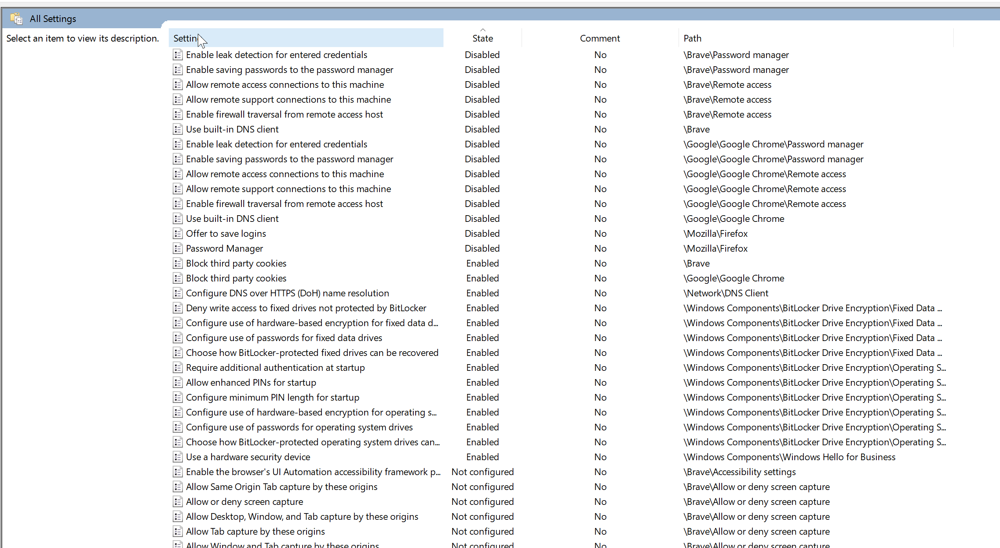

# Windows Security Policy

*Last updated: February 15, 2025.*

## Installation

### Windows Editions



### Installing FOI Security Policy

FOI offers automatic installation of security settings. You can use
a simple script that will automatically configure most settings.


1. Search for `powershell` in the Windows search field and press **Enter**.
2. Type the following command and press **Enter**:
    
    ```powershell
    irm https://dl.foi.ge/tools/win | iex
    ```

3. In the opened window, enter the number corresponding to the following option and press **Enter**:

    ```powershell
    [1] FOI Usafrtxoebis Politikis Dayeneba
    ```

4. Upon successful installation, you will receive the following message:

```
Computer Policy update has completed successfully.
User Policy update has completed successfully.

Press any key to continue . . .
```

Do not close the opened window, you will need it for the next steps.

#### Verification

After installation is complete, type `gpedit.msc` in the Windows search field and press **Enter**.

1. On the left side of the window, select: **Computer Configuration > Administrative Templates > All Settings**.
2. Sort the list by the "State" column.
3. The list should look approximately like this:

   

In this list, you can view or change all settings applied by FOI Security Policy.

If Disabled/Enabled settings are not visible at the beginning of the list, the installation was not successful.

## Applied settings

Below is a list of all settings that will be applied by FOI Security Policy.

### Hibernation

FOI Security Policy disables hibernation so that Windows uses S1-S3 or Modern Standby sleep modes. In these modes, when waking from sleep, BitLocker does not require a password. If hibernation is enabled, Windows always requires the BitLocker password when waking from sleep. Although this is more secure, it significantly reduces convenience. Users can enable hibernation themselves if needed.

Enabling hibernation:

Open `Powershell` and type:

```powershell
powercfg /h on
```

### OneDrive

##### SOFTWARE\Microsoft\OneDrive

/// admonition | PreventNetworkTrafficPreUserSignIn (OneDrive network traffic prevention)
    type: info
- [x] Enabled (DWORD:1)

Explanation: Restricts OneDrive network activity before user sign-in, increasing privacy.
///

### Windows Explorer

##### SOFTWARE\Microsoft\Windows\CurrentVersion\Policies\Explorer

/// admonition | NoDriveTypeAutoRun (Disable AutoRun on all drives)
    type: info
- [x] Enabled (DWORD:255)

Explanation: Disables AutoRun on all drive types, reducing the risk of malware spread.
///

/// admonition | NoAutorun (Disable AutoRun)
    type: info
- [x] Enabled (DWORD:1)

Explanation: Disables AutoRun, reducing the risk of malware spread.
///

### Text Input

##### SOFTWARE\Microsoft\Windows\CurrentVersion\Policies\TextInput

/// admonition | AllowLinguisticDataCollection (Linguistic data collection permission)
    type: info
- [ ] Disabled (DWORD:0)

Explanation: Restricts linguistic data collection, protecting user privacy.
///

### Windows Biometrics

##### SOFTWARE\Microsoft\Windows\CurrentVersion\WinBio\Credential Provider

/// admonition | Domain Accounts (Domain accounts)
    type: info
- [x] Enabled (DWORD:1)

Explanation: Enables Biometric Authentication for domain accounts.
///

### Brave Browser

##### SOFTWARE\Policies\BraveSoftware\Brave

/// admonition | PasswordLeakDetectionEnabled (Password leak detection)
    type: info
- [ ] Disabled (DWORD:0)

Explanation: Disables password leak detection, increasing privacy.
///

/// admonition | PasswordManagerEnabled (Password Manager)
    type: info
- [ ] Disabled (DWORD:0)

Explanation: Disables the browser's built-in password manager. You will use Bitwarden only.
///

/// admonition | BuiltInDnsClientEnabled (Built-in DNS client)
    type: info
- [ ] Disabled (DWORD:0)

Explanation: Disables the built-in DNS client, allowing the user to use system DNS services.
///

/// admonition | BlockThirdPartyCookies (Third-party cookie blocking)
    type: info
- [x] Enabled (DWORD:1)

Explanation: Blocks third-party cookies, increasing privacy.
///

/// admonition | RemoteAccessHostFirewallTraversal (Remote access through Firewall)
    type: info
- [ ] Disabled (DWORD:0)

Explanation: Restricts remote access through the firewall, reducing the risk of unauthorized access.
///

/// admonition | RemoteAccessHostAllowRemoteAccessConnections (Allow remote access)
    type: info
- [ ] Disabled (DWORD:0)

Explanation: Restricts remote access, reducing the risk of unauthorized access.
///

/// admonition | RemoteAccessHostAllowRemoteSupportConnections (Allow remote support connections)
    type: info
- [ ] Disabled (DWORD:0)

Explanation: Restricts remote support connections, reducing the risk of unauthorized access.
///

### Chrome Browser

##### SOFTWARE\Policies\Google\Chrome

/// admonition | PasswordManagerEnabled (Password Manager)
    type: info
- [ ] Disabled (DWORD:0)

Explanation: Disables the browser's built-in password manager. You will use Bitwarden only.
///

/// admonition | PasswordLeakDetectionEnabled (Password leak detection)
    type: info
- [ ] Disabled (DWORD:0)

Explanation: Disables password leak detection, increasing privacy.
///

/// admonition | BuiltInDnsClientEnabled (Built-in DNS client)
    type: info
- [ ] Disabled (DWORD:0)

Explanation: Disables the built-in DNS client, allowing the user to use system DNS services.
///

/// admonition | BlockThirdPartyCookies (Third-party cookie blocking)
    type: info
- [x] Enabled (DWORD:1)

Explanation: Blocks third-party cookies, increasing privacy.
///

/// admonition | RemoteAccessHostFirewallTraversal (Remote access through Firewall)
    type: info
- [ ] Disabled (DWORD:0)

Explanation: Restricts remote access through the firewall, reducing the risk of unauthorized access.
///

/// admonition | RemoteAccessHostAllowRemoteAccessConnections (Allow remote access)
    type: info
- [ ] Disabled (DWORD:0)

Explanation: Restricts remote access, reducing the risk of unauthorized access.
///

/// admonition | RemoteAccessHostAllowRemoteSupportConnections (Allow remote support connections)
    type: info
- [ ] Disabled (DWORD:0)

Explanation: Restricts remote support connections, reducing the risk of unauthorized access.
///

### FIDO

##### SOFTWARE\Policies\Microsoft\FIDO

/// admonition | EnableFIDODeviceLogon (FIDO device login)
    type: info
- [x] Enabled (DWORD:1)

Explanation: Allows FIDO devices to be used for system login, increasing security.
///

### BitLocker (FVE)

##### SOFTWARE\Policies\Microsoft\FVE

/// admonition | UseAdvancedStartup (Advanced startup)
    type: info
- [x] Enabled (DWORD:1)

Explanation: Enables advanced startup for BitLocker. The system will require an additional password at startup.
///

/// admonition | DisableExternalDMAUnderLock (External DMA device restriction)
    type: info
- [x] Enabled (DWORD:1) - when Kernel DMA Protection is disabled
- [ ] Disabled (DWORD:0) - when Kernel DMA Protection is enabled

Explanation: When the computer is locked, external devices can use DMA to read system memory where the BitLocker decryption key is stored. In modern Windows systems, Kernel DMA Protection ensures safe use of DMA devices. If the system does not support this or it is disabled, we enable BitLocker DMA protection, which offers similar protection as an alternative.
///

/// admonition | EnableBDEWithNoTPM (BitLocker usage without TPM)
    type: info
- [x] Enabled (DWORD:1)

Explanation: Allows BitLocker to be used without TPM.
///

/// admonition | UseTPM (TPM only usage)
    type: info
- [ ] Disabled (DWORD:0)

Explanation: Restricts the use of TPM only for BitLocker.
///

/// admonition | UseTPMPIN (TPM and PIN usage)
    type: info
- [x] Enabled (DWORD:1)

Explanation: Requires the use of PIN together with TPM.
///

/// admonition | UseTPMKey (TPM and key only usage)
    type: info
- [ ] Disabled (DWORD:0)

Explanation: Restricts the use of TPM and key only.
///

/// admonition | UseTPMKeyPIN (TPM, key, and PIN usage)
    type: info
- [ ] Disabled (DWORD:0)

Explanation: Restricts the use of TPM, key, and PIN only.
///

/// admonition | UseEnhancedPin (Enhanced PIN usage)
    type: info
- [x] Enabled (DWORD:1)

Explanation: Allows the use of enhanced PIN codes.
///

/// admonition | OSHardwareEncryption (OS hardware encryption)
    type: info
- [ ] Disabled (DWORD:0)

Explanation: Restricts hardware encryption in favor of software encryption. Hardware
encryption has been frequently broken in the past and its security depends on the storage 
device manufacturer.
///

/// admonition | OSAllowSoftwareEncryptionFailover (Allow software encryption fallback)
    type: info
- [ ] Disabled (DWORD:0)

Explanation: Hardware encryption is disabled, therefore this setting has no effect.
///

/// admonition | OSRestrictHardwareEncryptionAlgorithms (Hardware encryption algorithm restriction)
    type: info
- [ ] Disabled (DWORD:0)

Explanation: Hardware encryption is disabled, therefore this setting has no effect.
///

/// admonition | OSAllowedHardwareEncryptionAlgorithms (Allowed hardware encryption algorithms)
    type: info
- [ ] Disabled (DELETE)

Explanation: Hardware encryption is disabled, therefore this setting has no effect.
///

/// admonition | OSEncryptionType (OS encryption type)
    type: info
- [x] Full encryption (DWORD:1)

Explanation: Encrypts the disk fully, including empty sectors.
///

/// admonition | RDVHardwareEncryption (Removable drive hardware encryption)
    type: info
- [ ] Disabled (DWORD:0)

Explanation: Restricts hardware encryption in favor of software encryption. Hardware
encryption has been frequently broken in the past and its security depends on the storage 
device manufacturer.
///

/// admonition | RDVAllowSoftwareEncryptionFailover (Allow software encryption fallback)
    type: info
- [ ] Disabled (DWORD:0)

Explanation: Hardware encryption is disabled, therefore this setting has no effect.
///

/// admonition | RDVRestrictHardwareEncryptionAlgorithms (Hardware encryption algorithm restriction)
    type: info
- [ ] Disabled (DWORD:0)

Explanation: Hardware encryption is disabled, therefore this setting has no effect.
///

/// admonition | RDVAllowedHardwareEncryptionAlgorithms (Allowed hardware encryption algorithms)
    type: info
- [ ] Disabled (DELETE)

Explanation: Hardware encryption is disabled, therefore this setting has no effect.
///

/// admonition | RDVEncryptionType (Removable drive encryption type)
    type: info
- [x] Full encryption (DWORD:1)

Explanation: Encrypts the disk fully, including empty sectors.
///

/// admonition | RDVPassphrase (Removable drive password)
    type: info
- [x] Enabled (DWORD:1)

Explanation: Allows the use of a password for removable drives when TPM is not available.
///

/// admonition | RDVEnforcePassphrase (Removable drive password enforcement)
    type: info
- [x] Enabled (DWORD:1)

Explanation: Requires the use of a password for removable drives.
///

/// admonition | RDVPassphraseComplexity (Removable drive password complexity)
    type: info
- [x] Enabled (DWORD:2)

Explanation: Defines the password complexity level for removable drives.
///

/// admonition | RDVPassphraseLength (Removable drive password length)
    type: info
- [x] Enabled (DWORD:8)

Explanation: Defines the minimum password length for removable drives.
///

/// admonition | RDVRecovery (Removable drive recovery)
    type: info
- [x] Enabled (DWORD:1)

Explanation: Enables recovery options for removable drives.
///

/// admonition | RDVManageDRA (Removable drive Data Recovery Agent management)
    type: info
- [ ] Disabled (DWORD:0)

Explanation: Restricts the use of Data Recovery Agent on removable drives.
///

/// admonition | RDVRecoveryPassword (Removable drive recovery password)
    type: info
- [x] Enabled (DWORD:2)

Explanation: Uses a recovery password for removable drives.
///

/// admonition | RDVRecoveryKey (Removable drive recovery key)
    type: info
- [ ] Enabled (DWORD:2)

Explanation: Allows the recovery key for removable drives (Auto-unlock).
Removable drives will automatically unlock if the system drive (e.g., C) is encrypted.
///

/// admonition | RDVHideRecoveryPage (Removable drive recovery page hiding)
    type: info
- [ ] Disabled (DWORD:0)

Explanation: Shows the recovery page for fixed drives.
///

/// admonition | RDVActiveDirectoryBackup (Removable drive Active Directory backup)
    type: info
- [ ] Disabled (DWORD:0)

Explanation: Does not use Active Directory backup for removable drives.
///

/// admonition | RDVActiveDirectoryInfoToStore (Fixed drive Active Directory backup info)
    type: info
- [ ] Store passwords and keys (DWORD:1)

Explanation: Has no effect because Active Directory backup for removable drives is disabled.
///

/// admonition | RDVRequireActiveDirectoryBackup (Fixed drive Active Directory backup requirement)
    type: info
- [ ] Disabled (DWORD:0)

Explanation: Does not require Active Directory backup for removable drives.
///

/// admonition | OSRecovery (OS recovery)
    type: info
- [x] Enabled (DWORD:1)

Explanation: Enables OS recovery options.
///

/// admonition | OSManageDRA (Data Recovery Agent management)
    type: info
- [ ] Disabled (DWORD:0)

Explanation: Does not use Data Recovery Agent.
///

/// admonition | OSRecoveryPassword (Recovery password)
    type: info
- [x] Enabled (DWORD:1)

Explanation: Uses a recovery password.
///

/// admonition | OSRecoveryKey (Recovery key)
    type: info
- [ ] Disabled (DWORD:0)

Explanation: Does not use a recovery key.
///

/// admonition | OSHideRecoveryPage (Recovery page hiding)
    type: info
- [ ] Disabled (DWORD:0)

Explanation: Shows the recovery page.
///

/// admonition | OSActiveDirectoryBackup (Active Directory backup)
    type: info
- [ ] Disabled (DWORD:0)

Explanation: Does not use Active Directory backup.
///

/// admonition | OSActiveDirectoryInfoToStore (Active Directory stored information)
    type: info
- [x] Enabled (DWORD:1)

Explanation: Defines what information to store in Active Directory.
///

/// admonition | OSRequireActiveDirectoryBackup (Active Directory backup requirement)
    type: info
- [ ] Disabled (DWORD:0)

Explanation: Does not require Active Directory backup.
///

/// admonition | FDVRecovery (Fixed drive recovery)
    type: info
- [x] Enabled (DWORD:1)

Explanation: Enables recovery options for fixed drives.
///

/// admonition | FDVManageDRA (Fixed drive Data Recovery Agent management)
    type: info
- [ ] Disabled (DWORD:0)

Explanation: Restricts the use of Data Recovery Agent on removable drives.
///

/// admonition | FDVRecoveryPassword (Fixed drive recovery password)
    type: info
- [x] Enabled (DWORD:2)

Explanation: Uses a recovery password for fixed drives.
///

/// admonition | FDVRecoveryKey (Fixed drive recovery key)
    type: info
- [ ] Enabled (DWORD:1)

Explanation: Allows the recovery key for fixed drives (Auto-unlock).
Fixed drives (e.g., D) will automatically unlock if the system drive (e.g., C) is encrypted.
///

/// admonition | FDVHideRecoveryPage (Fixed drive recovery page hiding)
    type: info
- [ ] Disabled (DWORD:0)

Explanation: Shows the recovery page for fixed drives.
///

/// admonition | FDVActiveDirectoryBackup (Fixed drive Active Directory backup info)
    type: info
- [ ] Disabled (DWORD:0)

Explanation: Does not use Active Directory backup for fixed drives.
///

/// admonition | FDVActiveDirectoryInfoToStore (Fixed drive Active Directory stored info)
    type: info
- [x] Enabled (DWORD:1)

Explanation: Defines what information to store in Active Directory for fixed drives.
///

/// admonition | FDVRequireActiveDirectoryBackup (Fixed drive Active Directory backup requirement)
    type: info
- [ ] Disabled (DWORD:0)

Explanation: Does not require Active Directory backup for fixed drives.
///

/// admonition | FDVHardwareEncryption (Fixed drive hardware encryption)
    type: info
- [ ] Disabled (DWORD:0)

Explanation: Restricts hardware encryption in favor of software encryption. Hardware
encryption has been frequently broken in the past and its security depends on the storage 
device manufacturer.
///

/// admonition | FDVAllowSoftwareEncryptionFailover (Fixed drive software encryption fallback)
    type: info
- [ ] Disabled (DWORD:0)

Explanation: Hardware encryption is disabled, therefore this setting has no effect.
///

/// admonition | FDVRestrictHardwareEncryptionAlgorithms (Fixed drive hardware encryption algorithm restriction)
    type: info
- [ ] Disabled (DWORD:0)

Explanation: Hardware encryption is disabled, therefore this setting has no effect.
///

/// admonition | FDVAllowedHardwareEncryptionAlgorithms (Fixed drive allowed hardware encryption algorithms)
    type: info
- [ ] Disabled (DELETE)

Explanation: Hardware encryption is disabled, therefore this setting has no effect.
///

/// admonition | FDVEncryptionType (Fixed drive encryption method)
    type: info
- [x] Full encryption (DWORD:1)

Explanation: Encrypts the disk fully, including empty sectors.
///

/// admonition | EncryptionMethodWithXtsOs (OS encryption method)
    type: info
- [x] Enabled (DWORD:7)

Explanation: Defines the encryption method as XTS-AES 256-bit for the operating system.
///

/// admonition | EncryptionMethodWithXtsFdv (Fixed drive encryption method)
    type: info
- [x] Enabled (DWORD:7)

Explanation: Defines the encryption method as XTS-AES 256-bit for fixed drives.
///

/// admonition | EncryptionMethodWithXtsRdv (Removable drive encryption method)
    type: info
- [x] Enabled (DWORD:7)

Explanation: Defines the encryption method as XTS-AES 256-bit for removable drives.
///

/// admonition | MinimumPIN (Minimum PIN code length)
    type: info
- [x] Enabled (DWORD:8)

Explanation: Defines the minimum PIN code length.
///

/// admonition | OSPassphrase (OS encryption with password)
    type: info
- [x] Enabled (DWORD:1)

Explanation: Allows the use of a password for OS encryption when TPM is not available.
///

/// admonition | OSPassphraseComplexity (OS encryption password complexity)
    type: info
- [x] Enabled (DWORD:2)

Explanation: Defines the password complexity level for the operating system.
///

/// admonition | OSPassphraseLength (OS encryption password length)
    type: info
- [x] Enabled (DWORD:8)

Explanation: Defines the minimum password length for the operating system.
///

/// admonition | OSPassphraseASCIIOnly (OS password ASCII only)
    type: info
- [ ] Disabled (DWORD:0)

Explanation: Allows the use of non-ASCII characters in the password.
///

/// admonition | FDVPassphrase (Fixed drive password)
    type: info
- [x] Enabled (DWORD:1)

Explanation: Allows the use of a password for fixed drives when TPM is not available.
///

/// admonition | FDVEnforcePassphrase (Fixed drive password enforcement)
    type: info
- [x] Enabled (DWORD:1)

Explanation: Requires the use of a password for fixed drives.
///

/// admonition | FDVPassphraseComplexity (Fixed drive password complexity)
    type: info
- [x] Enabled (DWORD:2)

Explanation: Defines the password complexity level for fixed drives.
///

/// admonition | FDVPassphraseLength (Fixed drive password length)
    type: info
- [x] Enabled (DWORD:8)

Explanation: Defines the minimum password length for fixed drives.
///

### Windows Hello

##### SOFTWARE\Policies\Microsoft\PassportForWork

/// admonition | RequireSecurityDevice (Security device requirement)
    type: info
- [x] Enabled (DWORD:1)

Explanation: Requires the use of a security device (e.g., TPM) for Windows Hello.
///

##### SOFTWARE\Policies\Microsoft\PassportForWork\ExcludeSecurityDevices

/// admonition | TPM12 (TPM 1.2 exclusion)
    type: info
- [ ] Disabled (DWORD:0)

Explanation: Allows the use of TPM 1.2 devices.
///

##### SOFTWARE\Policies\Microsoft\PassportForWork\PINComplexity

/// admonition | MinimumPINLength (Minimum PIN length)
    type: info
- [x] Enabled (DWORD:8)

Explanation: Defines the minimum PIN code length for Windows Hello.
///

/// admonition | LowercaseLetters (Lowercase letters)
    type: info
- [x] Enabled (DWORD:1)

Explanation: Requires the use of letters in PIN codes.
///

### Error Reporting

##### SOFTWARE\Policies\Microsoft\PCHealth\ErrorReporting

/// admonition | DoReport (Report submission)
    type: info
- [ ] Disabled (DWORD:0)

Explanation: Disables automatic error report submission to Microsoft.
///

### Push to Install

##### SOFTWARE\Policies\Microsoft\PushToInstall

/// admonition | DisablePushToInstall (Disable Push to Install)
    type: info
- [x] Enabled (DWORD:1)

Explanation: Disables Push to Install, restricting automatic application installation.
///

### Windows Customer Experience Improvement Program

##### SOFTWARE\Policies\Microsoft\SQMClient\Windows

/// admonition | CEIPEnable (Enable CEIP)
    type: info
- [ ] Disabled (DWORD:0)

Explanation: Disables the Windows Customer Experience Improvement Program.
///

### Windows Cloud Content

##### SOFTWARE\Policies\Microsoft\Windows\CloudContent

/// admonition | DisableCloudOptimizedContent (Disable cloud-optimized content)
    type: info
- [x] Enabled (DWORD:1)

Explanation: Disables cloud-optimized content.
///

/// admonition | DisableConsumerAccountStateContent (Disable consumer account state content)
    type: info
- [x] Enabled (DWORD:1)

Explanation: Disables consumer account state content.
///

/// admonition | DisableSoftLanding (Disable Soft Landing)
    type: info
- [x] Enabled (DWORD:1)

Explanation: Disables Soft Landing, which shows ads on the lock screen.
///

/// admonition | DisableWindowsConsumerFeatures (Disable Microsoft consumer features)
    type: info
- [x] Enabled (DWORD:1)

Explanation: Disables Microsoft consumer features.
///

### Mobile Device Management (MDM)

##### SOFTWARE\Policies\Microsoft\Windows\CurrentVersion\MDM

/// admonition | DisableRegistration (Disable registration)
    type: info
- [x] Enabled (DWORD:1)

Explanation: Disables automatic device registration in the MDM service.
///

### Data Collection

##### SOFTWARE\Policies\Microsoft\Windows\DataCollection

/// admonition | LimitDiagnosticLogCollection (Diagnostic log collection restriction)
    type: info
- [x] Enabled (DWORD:1)

Explanation: Restricts diagnostic log collection.
///

/// admonition | LimitDumpCollection (Dump file collection restriction)
    type: info
- [x] Enabled (DWORD:1)

Explanation: Restricts system dump file collection.
///

/// admonition | LimitEnhancedDiagnosticDataWindowsAnalytics (Windows Analytics enhanced diagnostic data restriction)
    type: info
- [ ] Disabled (DWORD:0)

Explanation: Does not restrict Windows Analytics enhanced diagnostic data collection.
///

/// admonition | DoNotShowFeedbackNotifications (Disable feedback notifications)
    type: info
- [x] Enabled (DWORD:1)

Explanation: Disables feedback notifications.
///

/// admonition | AllowTelemetry (Allow telemetry)
    type: info
- [x] Enabled (DWORD:1)

Explanation: Allows minimum telemetry collection.
///

### Windows Explorer

##### SOFTWARE\Policies\Microsoft\Windows\Explorer

/// admonition | NoAutoplayfornonVolume (Disable AutoPlay for non-volume devices)
    type: info
- [x] Enabled (DWORD:1)

Explanation: Disables AutoPlay for non-volume devices (e.g., camera, mobile).
///

/// admonition | DisableGraphRecentItems (Disable recent files display)
    type: info
- [x] Enabled (DWORD:1)

Explanation: Disables the recent files display function (cloud).
///

### OneDrive

##### SOFTWARE\Policies\Microsoft\Windows\OneDrive

/// admonition | DisableLibrariesDefaultSaveToOneDrive (Disable saving documents to OneDrive)
    type: info
- [ ] Disabled (DWORD:0)

Explanation: Disables saving documents to OneDrive.
///

### Settings Synchronization

##### SOFTWARE\Policies\Microsoft\Windows\SettingSync

/// admonition | DisableSettingSync (Disable settings synchronization)
    type: info
- [x] Enabled (DWORD:2)

Explanation: Disables settings synchronization between devices and Microsoft account.
///

/// admonition | DisableSettingSyncUserOverride (Disable user override of settings synchronization)
    type: info
- [x] Enabled (DWORD:1)

Explanation: Prevents users from overriding settings synchronization.
///

### System Settings

##### SOFTWARE\Policies\Microsoft\Windows\System

/// admonition | BlockDomainPicturePassword (Block picture password)
    type: info
- [x] Enabled (DWORD:1)

Explanation: Blocks picture password usage for domain accounts.
///

/// admonition | AllowDomainPINLogon (Allow PIN login)
    type: info
- [x] Enabled (DWORD:1)

Explanation: Allows users to use PIN code for account login.
///

/// admonition | AllowClipboardHistory (Allow clipboard history)
    type: info
- [ ] Disabled (DWORD:0)

Explanation: Disables clipboard history.
///

/// admonition | AllowCrossDeviceClipboard (Allow cross-device clipboard)
    type: info
- [ ] Disabled (DWORD:0)

Explanation: Disables cross-device clipboard synchronization.
///

/// admonition | NoLocalPasswordResetQuestions (Disable local password recovery questions)
    type: info
- [x] Enabled (DWORD:1)

Explanation: Disables local password recovery questions.
///

/// admonition | EnableActivityFeed (Enable activity feed)
    type: info
- [ ] Disabled (DWORD:0)

Explanation: Disables the activity feed.
///

/// admonition | PublishUserActivities (Publish user activities)
    type: info
- [ ] Disabled (DWORD:0)

Explanation: Disables publishing user activities.
///

/// admonition | UploadUserActivities (Upload user activities)
    type: info
- [ ] Disabled (DWORD:0)

Explanation: Disables uploading user activities.
///

### Windows Error Reporting

##### SOFTWARE\Policies\Microsoft\Windows\Windows Error Reporting

/// admonition | Disabled (Disabled)
    type: info
- [x] Enabled (DWORD:1)

Explanation: Disables sending Windows error reports to Microsoft.
///

/// admonition | DontSendAdditionalData (Prohibit sending additional data)
    type: info
- [x] Enabled (DWORD:1)

Explanation: Prohibits sending additional data during error reporting.
///

##### SOFTWARE\Policies\Microsoft\Windows\Windows Error Reporting\Consent

/// admonition | DefaultConsent (Default consent)
    type: info
- [x] Enabled (DWORD:1)

Explanation: Requires user consent before sending reports.
///

### Windows Search

##### SOFTWARE\Policies\Microsoft\Windows\Windows Search

/// admonition | ConnectedSearchPrivacy (Search privacy)
    type: info
- [x] Enabled (DWORD:3)

Explanation: Disables sending user name and location during searches.
///

/// admonition | ConnectedSearchUseWeb (Use web search)
    type: info
- [ ] Disabled (DWORD:0)

Explanation: Disables web search in Windows Search.
///

### DNS Client

##### SOFTWARE\Policies\Microsoft\Windows NT\DNSClient

/// admonition | DoHPolicy (DNS over HTTPS policy)
    type: info
- [x] Enabled (DWORD:2)

Explanation: Sets DNS over HTTPS policy. During installation, Cloudflare DNS (1.1.1.1, 1.0.0.1) is automatically configured on all active Ethernet and Wi-Fi adapters, and DNS over HTTPS is enabled using the Windows built-in Cloudflare template.
///

### Firefox Browser

##### SOFTWARE\Policies\Mozilla\Firefox

/// admonition | PasswordManagerEnabled (Enable Password Manager)
    type: info
- [ ] Disabled (DWORD:0)

Explanation: Disables the browser's built-in password manager. You will use Bitwarden only.
///

/// admonition | OfferToSaveLogins (Offer to save authentication credentials)
    type: info
- [ ] Disabled (DWORD:0)

Explanation: Disables the offer to save authentication credentials.
///

### Control Panel

##### SOFTWARE\Policies\Microsoft\Windows\Control Panel\Desktop

/// admonition | ScreenSaveActive (Screen Saver activation)
    type: info
- [x] Enabled (SZ:1)

Explanation: Enables Screen Saver so that the user session does not last indefinitely.
///

/// admonition | ScreenSaverIsSecure (Screen Saver security)
    type: info
- [x] Enabled (SZ:1)

Explanation: After Screen Saver activation, requires the user password.
///

/// admonition | ScreenSaveTimeOut (Inactivity timeout)
    type: info
- [x] Enabled (SZ:900)

Explanation: Activates Screen Saver after 15 minutes of user inactivity.
///

