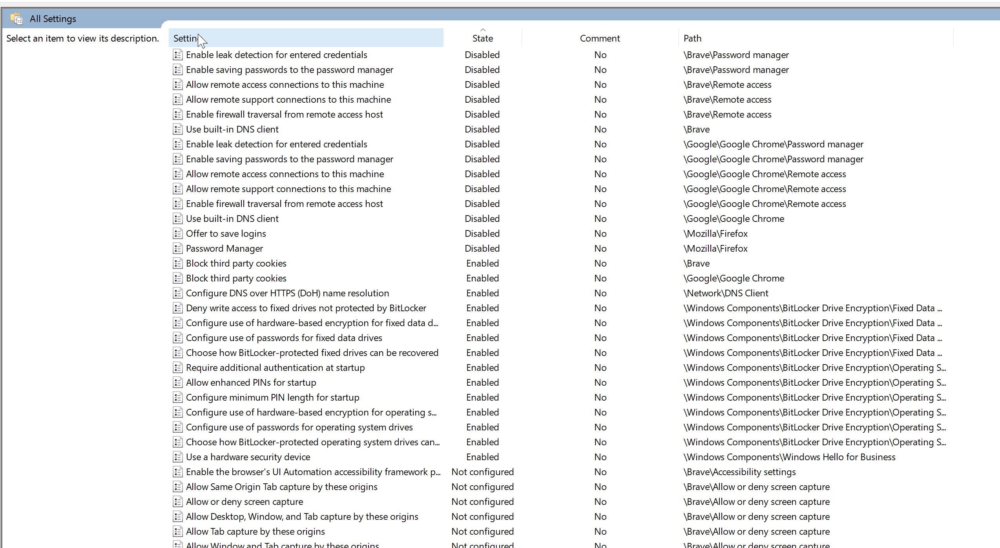

# Windows უსაფრთხოების პოლიტიკა

FOI Security Policy ავტომატურად გააქტიურდება ყველა მომხმარებელზე.

## ინსტალაცია

### Windows-ის ვერსიის შეცვლა

პარამეტრების გამოსაყენებლად, დაგჭირდებათ **Windows Pro** ან **Windows IoT Enterprise** ვერსია [;)](https://github.com/massgravel/Microsoft-Activation-Scripts)

### FOI უსაფრთხოების პოლიტიკის დაყენება

FOI გთავაზობთ უსაფრთხოების პარამეტრების ავტომატურ ინსტალაციას. ამისთვის შეგიძლიათ
გამოიყენოთ მარტივი სკრიპტი, რომელიც პარამეტრების უმრავლესობას ავტომატურად გამართავს.


1. მოძებნეთ Windows-ის ძიების ველში `powershell` და დააჭირეთ **Enter**.
2. ჩაწერეთ შემდეგი ბრძანება და დააჭირეთ **Enter**:
    
    ```powershell
    irm https://dl.foi.ge/tools/win | iex
    ```

3. გახსნილ ფანჯარაში შეიყვანეთ შემდეგი პარამეტრის შესაბამისი ციფრი და დააჭირეთ **Enter**-ს:

    ```powershell
    1. Install FOI Security Policy
    ```

4. წარმატებული ინსტალაციის შემთხვევაში, მიიღებთ შემდეგ შეტყობინებას:

```
Computer Policy update has completed successfully.
User Policy update has completed successfully.

Press any key to continue . . .
```

გახსნილი ფანჯარა არ დახუროთ, შემდეგ ნაბიჯებზე დაგჭირდებათ.

#### ვერიფიკაცია

ინსტალაციის დასრულების შემდეგ, Windows ძიების ველში ჩაწერეთ `gpedit.msc`, დააჭირეთ **Enter**.

1. ფანჯრის მარცხენა მხარეს აირჩიეთ: **Computer Configuration > Administrative Templates > All Settings**.
2. დაალაგეთ სია "State" სვეტის მიხედვით.
3. სია დაახლოებით ასე უნდა გამოიყურებოდეს:

   

ამ ჩამონათვალში შეგიძლიათ ნახოთ, ან შეცვალოთ FOI Security Policy-ის მიერ დაყენებული ყველა პარამეტრი.

იმ შემთხვევაში, თუ სიის დასაწყისში Disabled/Enabled პარამეტრები არ ჩანს, ინსტალაცია არ იყო წარმატებული.


## გამოყენებული პარამეტრები

ქვემოთ ჩამოთვილილა ყველა პარამეტრი, რომელიც FOI უსაფრთხოების პოლიტიკით დაყენდება.

### OneDrive

##### SOFTWARE\Microsoft\OneDrive

/// admonition | PreventNetworkTrafficPreUserSignIn (OneDrive ქსელური ტრაფიკის პრევენცია)
    type: info
- [x] ჩართული (DWORD:1)

განმარტება: ზღუდავს OneDrive-ის ქსელურ აქტივობას მომხმარებლის შესვლამდე, რაც ზრდის პრივატულობას.
///

### Windows Explorer

##### SOFTWARE\Microsoft\Windows\CurrentVersion\Policies\Explorer

/// admonition | NoDriveTypeAutoRun (AutoRun-ის გამორთვა ყველა დისკზე)
    type: info
- [x] ჩართული (DWORD:255)

განმარტება: გამორთავს AutoRun ფუნქციას ყველა ტიპის დისკზე, რაც ამცირებს მავნე პროგრამების გავრცელების რისკს.
///

/// admonition | NoAutorun (AutoRun-ის გამორთვა)
    type: info
- [x] ჩართული (DWORD:1)

განმარტება: გამორთავს AutoRun ფუნქციას, რაც ამცირებს მავნე პროგრამების გავრცელების რისკს.
///

### ტექსტის შეყვანა

##### SOFTWARE\Microsoft\Windows\CurrentVersion\Policies\TextInput

/// admonition | AllowLinguisticDataCollection (ლინგვისტური მონაცემების შეგროვების ნებართვა)
    type: info
- [ ] გამორთული (DWORD:0)

განმარტება: ზღუდავს ლინგვისტური მონაცემების შეგროვებას, რაც იცავს მომხმარებლის პრივატულობას.
///

### Windows Biometrics

##### SOFTWARE\Microsoft\Windows\CurrentVersion\WinBio\Credential Provider

/// admonition | Domain Accounts (დომენის ანგარიშები)
    type: info
- [x] ჩართული (DWORD:1)

განმარტება: ჩართავს ბიომეტრიულ ავთენტიფიკაციას დომენის ანგარიშებისთვის.
///

### Brave ბრაუზერი

##### SOFTWARE\Policies\BraveSoftware\Brave

/// admonition | PasswordLeakDetectionEnabled (პაროლის გაჟონვის აღმოჩენა)
    type: info
- [ ] გამორთული (DWORD:0)

განმარტება: გამორთავს პაროლის გაჟონვის აღმოჩენის ფუნქციას, რაც ზრდის პრივატულობას.
///

/// admonition | PasswordManagerEnabled (პაროლების მენეჯერი)
    type: info
- [ ] გამორთული (DWORD:0)

განმარტება: გამორთავს ბრაუზერში ჩაშენებულ პაროლების მენეჯერს. გამოიყენებთ მხოლოდ Bitwarden-ს.
///

/// admonition | BuiltInDnsClientEnabled (ჩაშენებული DNS კლიენტი)
    type: info
- [ ] გამორთული (DWORD:0)

განმარტება: გამორთავს ჩაშენებულ DNS კლიენტს, რაც საშუალებას აძლევს მომხმარებელს, გამოიყენოს სისტემური DNS სერვისები.
///

/// admonition | BlockThirdPartyCookies (მესამე მხარის ქუქი-ფაილების ბლოკირება)
    type: info
- [x] ჩართული (DWORD:1)

განმარტება: ბლოკავს მესამე მხარის ქუქი-ფაილებს, რაც ზრდის პრივატულობას.
///

/// admonition | RemoteAccessHostFirewallTraversal (დისტანციური წვდომა Firewall-ის გავლით)
    type: info
- [ ] გამორთული (DWORD:0)

განმარტება: ზღუდავს დისტანციურ წვდომას firewall-ის გავლით, რაც ამცირებს არაავტორიზებული წვდომის რისკს.
///

/// admonition | RemoteAccessHostAllowRemoteAccessConnections (დისტანციური წვდომის დაშვება)
    type: info
- [ ] გამორთული (DWORD:0)

განმარტება: ზღუდავს დისტანციური წვდომas, რაც ამცირებს არაავტორიზებული წვდომის რისკს.
///

/// admonition | RemoteAccessHostAllowRemoteSupportConnections (დისტანციური მხარდაჭერის კავშირების დაშვება)
    type: info
- [ ] გამორთული (DWORD:0)

განმარტება: ზღუდავს დისტანციური მხარდაჭერის კავშირებს, რაც ამცირებს არაავტორიზებული წვდომის რისკს.
///

### Chrome ბრაუზერი

##### SOFTWARE\Policies\Google\Chrome

/// admonition | PasswordManagerEnabled (პაროლების მენეჯერი)
    type: info
- [ ] გამორთული (DWORD:0)

განმარტება: გამორთავს ბრაუზერში ჩაშენებულ პაროლების მენეჯერს. გამოიყენებთ მხოლოდ Bitwarden-ს.
///

/// admonition | PasswordLeakDetectionEnabled (პაროლის გაჟონვის აღმოჩენა)
    type: info
- [ ] გამორთული (DWORD:0)

განმარტება: გამორთავს პაროლის გაჟონვის აღმოჩენის ფუნქციას, რაც ზრდის პრივატულობას.
///

/// admonition | BuiltInDnsClientEnabled (ჩაშენებული DNS კლიენტი)
    type: info
- [ ] გამორთული (DWORD:0)

განმარტება: გამორთავს ჩაშენებულ DNS კლიენტს, რაც საშუალებას აძლევს მომხმარებელს, გამოიყენოს სისტემური DNS სერვისები.
///

/// admonition | BlockThirdPartyCookies (მესამე მხარის ქუქი-ფაილების ბლოკირება)
    type: info
- [x] ჩართული (DWORD:1)

განმარტება: ბლოკავს მესამე მხარის ქუქი-ფაილებს, რაც ზრდის პრივატულობას.
///

/// admonition | RemoteAccessHostFirewallTraversal (დისტანციური წვდომა Firewall-ის გავლით)
    type: info
- [ ] გამორთული (DWORD:0)

განმარტება: ზღუდავს დისტანციურ წვდომას firewall-ის გავლით, რაც ამცირებს არაავტორიზებული წვდომის რისკს.
///

/// admonition | RemoteAccessHostAllowRemoteAccessConnections (დისტანციური წვდომის დაშვება)
    type: info
- [ ] გამორთული (DWORD:0)

განმარტება: ზღუდავს დისტანციურ წვდომას, რაც ამცირებს არაავტორიზებული წვდომის რისკს.
///

/// admonition | RemoteAccessHostAllowRemoteSupportConnections (დისტანციური მხარდაჭერის კავშირების დაშვება)
    type: info
- [ ] გამორთული (DWORD:0)

განმარტება: ზღუდავს დისტანციური მხარდაჭერის კავშირებს, რაც ამცირებს არაავტორიზებული წვდომის რისკს.
///

### FIDO

##### SOFTWARE\Policies\Microsoft\FIDO

/// admonition | EnableFIDODeviceLogon (FIDO მოწყობილობით შესვლა)
    type: info
- [x] ჩართული (DWORD:1)

განმარტება: საშუალებას აძლევს FIDO მოწყობილობებს გამოყენებულ იქნას სისტემაში შესასვლელად, რაც ზრდის უსაფრთხოებას.
///

### BitLocker (FVE)

##### SOFTWARE\Policies\Microsoft\FVE

/// admonition | UseAdvancedStartup (გაფართოებული ჩართვა)
    type: info
- [x] ჩართული (DWORD:1)

განმარტება: რთავს გაფართოებულ ჩართვას BitLocker-ისთვის. სისტემა ჩართვისას დამატებით პაროლს მოითხოვს.
///

/// admonition | EnableBDEWithNoTPM (BitLocker-ის გამოყენება TPM-ის გარეშე)
    type: info
- [x] ჩართული (DWORD:1)

განმარტება: საშუალებას იძლევა BitLocker გამოყენებულ იქნას TPM-ის გარეშე.
///

/// admonition | UseTPM (მხოლოდ TPM-ის გამოყენება)
    type: info
- [ ] გამორთული (DWORD:0)

განმარტება: ზღუდავს მხოლოდ TPM-ის გამოყენებას BitLocker-ისთვის.
///

/// admonition | UseTPMPIN (TPM და PIN-ის გამოყენება)
    type: info
- [x] ჩართული (DWORD:1)

განმარტება: მოითხოვს TPM-თან ერთად PIN-ის გამოყენებას.
///

/// admonition | UseTPMKey (მხოლოდ TPM და გასაღების გამოყენება)
    type: info
- [ ] გამორთული (DWORD:0)

განმარტება: ზღუდავს მხოლოდ TPM და გასაღების გამოყენებას.
///

/// admonition | UseTPMKeyPIN (TPM, გასაღებისა და PIN-ის გამოყენება)
    type: info
- [ ] გამორთული (DWORD:0)

განმარტება: ზღუდავს მხოლოდ TPM, გასაღებისა და PIN გამოყენებას.
///

/// admonition | UseEnhancedPin (ძლიერი PIN-ის გამოყენება)
    type: info
- [x] ჩართული (DWORD:1)

განმარტება: საშუალებას იძლევა გამოყენებულ იქნას ძლიერი PIN-კოდები.
///

/// admonition | OSHardwareEncryption (ოპერაციული სისტემის აპარატურული შიფრაცია)
    type: info
- [ ] გამორთული (DWORD:0)

განმარტება: ზღუდავს აპარატურულ შიფრაციას, პროგრამულის სანაცვლოდ. აპარატურული
შიფრაცია წარსულში ხშირად გატეხილა და მისი უსაფრთხოება დამოკიდებულია შემნახველი 
მოწყობილობის მწარმოებელზე.
///

/// admonition | OSAllowSoftwareEncryptionFailover (პროგრამული შიფრაციის დაშვება)
    type: info
- [ ] გამორთული (DWORD:0)

განმარტება: აპარატურული შიფრაცია გათიშულია, შესაბამისად, ამ პარამეტრს ეფექტი არ აქვს.
///

/// admonition | OSRestrictHardwareEncryptionAlgorithms (აპარატურული შიფრაციის ალგორითმების შეზღუდვა)
    type: info
- [ ] გამორთული (DWORD:0)

განმარტება: აპარატურული შიფრაცია გათიშულია, შესაბამისად, ამ პარამეტრს ეფექტი არ აქვს.
///

/// admonition | OSAllowedHardwareEncryptionAlgorithms (დაშვებული აპარატურული შიფრაციის ალგორითმები)
    type: info
- [ ] გამორთული (DELETE)

განმარტება: აპარატურული შიფრაცია გათიშულია, შესაბამისად, ამ პარამეტრს ეფექტი არ აქვს.
///

/// admonition | OSEncryptionType (ოპერაციული სისტემის შიფრაციის ტიპი)
    type: info
- [x] სრული შიფრაცია (DWORD:1)

განმარტება: დაშიფრავს დისკს სრულად, ცარიელი სექტორების ჩათვლით.
///

/// admonition | RDVHardwareEncryption (გარე მყარი დისკის აპარატურული შიფრაცია)
    type: info
- [ ] გამორთული (DWORD:0)

განმარტება: ზღუდავს აპარატურულ შიფრაციას, პროგრამულის სანაცვლოდ. აპარატურული
შიფრაცია წარსულში ხშირად გატეხილა და მისი უსაფრთხოება დამოკიდებულია შემნახველი 
მოწყობილობის მწარმოებელზე.
///

/// admonition | RDVAllowSoftwareEncryptionFailover (პროგრამული შიფრაციის დაშვება)
    type: info
- [ ] გამორთული (DWORD:0)

განმარტება: აპარატურული შიფრაცია გათიშულია, შესაბამისად, ამ პარამეტრს ეფექტი არ აქვს.
///

/// admonition | RDVRestrictHardwareEncryptionAlgorithms (აპარატურული შიფრაციის ალგორითმების შეზღუდვა)
    type: info
- [ ] გამორთული (DWORD:0)

განმარტება: აპარატურული შიფრაცია გათიშულია, შესაბამისად, ამ პარამეტრს ეფექტი არ აქვს.
///

/// admonition | RDVAllowedHardwareEncryptionAlgorithms (დაშვებული აპარატურული შიფრაციის ალგორითმები)
    type: info
- [ ] გამორთული (DELETE)

განმარტება: აპარატურული შიფრაცია გათიშულია, შესაბამისად, ამ პარამეტრს ეფექტი არ აქვს.
///

/// admonition | RDVEncryptionType (გარე დისკის შიფრაციის ტიპი)
    type: info
- [x] სრული შიფრაცია (DWORD:1)

განმარტება: დაშიფრავს დისკს სრულად, ცარიელი სექტორების ჩათვლით.
///

/// admonition | RDVPassphrase (გარე დისკის პაროლი)
    type: info
- [x] ჩართული (DWORD:1)

განმარტება: საშუალებას იძლევა გამოყენებულ იქნას პაროლი გარე დისკებისთვის, როცა TPM არაა ხელმისაწვდომი.
///

/// admonition | RDVEnforcePassphrase (გარე დისკის პაროლის იძულება)
    type: info
- [x] ჩართული (DWORD:1)

განმარტება: მოითხოვს პაროლის გამოყენებას გარე დისკებისთვის.
///

/// admonition | RDVPassphraseComplexity (გარე დისკის პაროლის სირთულე)
    type: info
- [x] ჩართული (DWORD:2)

განმარტება: განსაზღვრავს პაროლის სირთულის დონეს გარე დისკებისთვის.
///

/// admonition | RDVPassphraseLength (გარე დისკის პაროლის სიგრძე)
    type: info
- [x] ჩართული (DWORD:8)

განმარტება: განსაზღვრავს მინიმალურ პაროლის სიგრძეს გარე დისკებისთვის.
///

/// admonition | RDVRecovery (გარე დისკის აღდგენა)
    type: info
- [x] ჩართული (DWORD:1)

განმარტება: რთავს გარე დისკის აღდგენის ოფციებს.
///

/// admonition | RDVManageDRA (გარე დისკის Data Recovery Agent-ის მართვა)
    type: info
- [ ] გამორთული (DWORD:0)

განმარტება:  ზღუდავს გარე დისკზე Data Recovery Agent-ის გამოყენების უფლებას.
///

/// admonition | RDVRecoveryPassword (გარე დისკის აღდგენის პაროლი)
    type: info
- [x] ჩართული (DWORD:2)

განმარტება: იყენებს აღდგენის პაროლს გარე დისკებისთვის.
///

/// admonition | RDVRecoveryKey (გარე დისკის აღდგენის გასაღები)
    type: info
- [ ] ჩართული (DWORD:2)

განმარტება: უშვებს აღდგენის გასაღებს გარე დისკებისთვის (Auto-unlock).
გარე დისკები ავტომატურად გაიხსნება იმ შემთხვევაში, თუ სისტემური დისკი (მაგ. C) დაშიფრულია.
///

/// admonition | RDVHideRecoveryPage (გარე დისკის აღდგენის გვერდის დამალვა)
    type: info
- [ ] გამორთული (DWORD:0)

განმარტება: აჩვენებს აღდგენის გვერდს ფიქსირებული დისკებისთვის.
///

/// admonition | RDVActiveDirectoryBackup (გარე დისკის Active Directory-ში სარეზერვო ასლის შენახვა)
    type: info
- [ ] გამორთული (DWORD:0)

განმარტება: არ იყენებს Active Directory-ში სარეზერვო ასლის შენახვას გარე დისკებისთვის.
///

/// admonition | RDVActiveDirectoryInfoToStore (ფიქსირებული დისკის Active Directory-ში სარეზერვო ასლის შენახვა)
    type: info
- [ ] პაროლების და გასაღების შენახვა (DWORD:1)

განმარტება: არ აქვს ეფექტი, რადგან Active Directory-ში სარეზერვო ასლის შენახვას გარე დისკებისთვის გამორთულია.
///

/// admonition | RDVRequireActiveDirectoryBackup (ფიქსირებული დისკის Active Directory-ში სარეზერვო ასლის შენახვის მოთხოვნა)
    type: info
- [ ] გამორთული (DWORD:0)

განმარტება: არ მოითხოვს Active Directory-ში სარეზერვო ასლის შენახვას გარე დისკებისთვის.
///

/// admonition | OSRecovery (ოპერაციული სისტემის აღდგენა)
    type: info
- [x] ჩართული (DWORD:1)

განმარტება: რთავს ოპერაციული სისტემის აღდგენის ოფციებს.
///

/// admonition | OSManageDRA (Data Recovery Agent-ის მართვა)
    type: info
- [ ] გამორთული (DWORD:0)

განმარტება: არ იყენებს Data Recovery Agent-ს.
///

/// admonition | OSRecoveryPassword (აღდგენის პაროლი)
    type: info
- [x] ჩართული (DWORD:1)

განმარტება: იყენებს აღდგენის პაროლს.
///

/// admonition | OSRecoveryKey (აღდგენის გასაღები)
    type: info
- [ ] გამორთული (DWORD:0)

განმარტება: არ იყენებს აღდგენის გასაღებს.
///

/// admonition | OSHideRecoveryPage (აღდგენის გვერდის დამალვა)
    type: info
- [ ] გამორთული (DWORD:0)

განმარტება: აჩვენებს აღდგენის გვერდს.
///

/// admonition | OSActiveDirectoryBackup (Active Directory-ში სარეზერვო ასლის შენახვა)
    type: info
- [ ] გამორთული (DWORD:0)

განმარტება: არ იყენებს Active Directory-ში სარეზერვო ასლის შენახვას.
///

/// admonition | OSActiveDirectoryInfoToStore (Active Directory-ში შესანახი ინფორმაცია)
    type: info
- [x] ჩართული (DWORD:1)

განმარტება: განსაზღვრავს, რა ინფორმაცია შეინახოს Active Directory-ში.
///

/// admonition | OSRequireActiveDirectoryBackup (Active Directory-ში სარეზერვო ასლის შენახვის მოთხოვნა)
    type: info
- [ ] გამორთული (DWORD:0)

განმარტება: არ მოითხოვს Active Directory-ში სარეზერვო ასლის შენახვას.
///

/// admonition | FDVRecovery (ფიქსირებული დისკის აღდგენა)
    type: info
- [x] ჩართული (DWORD:1)

განმარტება: რთავს ფიქსირებული დისკის აღდგენის ოფციებს.
///

/// admonition | FDVManageDRA (ფიქსირებული დისკის Data Recovery Agent-ის მართვა)
    type: info
- [ ] გამორთული (DWORD:0)

განმარტება: ზღუდავს გარე დისკზე Data Recovery Agent-ის გამოყენების უფლებას.
///

/// admonition | FDVRecoveryPassword (ფიქსირებული დისკის აღდგენის პაროლი)
    type: info
- [x] ჩართული (DWORD:2)

განმარტება: იყენებს აღდგენის პაროლს ფიქსირებული დისკებისთვის.
///

/// admonition | FDVRecoveryKey (ფიქსირებული დისკის აღდგენის გასაღები)
    type: info
- [ ] ჩართული (DWORD:1)

განმარტება: უშვებს აღდგენის გასაღებს ფიქსირებული დისკებისთვის (Auto-unlock).
ფიქსირებული დისკები (მაგ. D) ავტომატურად გაიხსნება იმ შემთხვევაში, თუ სისტემური დისკი (მაგ. C) დაშიფრულია.
///

/// admonition | FDVHideRecoveryPage (ფიქსირებული დისკის აღდგენის გვერდის დამალვა)
    type: info
- [ ] გამორთული (DWORD:0)

განმარტება: აჩვენებს აღდგენის გვერდს ფიქსირებული დისკებისთვის.
///

/// admonition | FDVActiveDirectoryBackup (ფიქსირებული დისკის Active Directory-ში სარეზერვო ასლის შენახვა)
    type: info
- [ ] გამორთული (DWORD:0)

განმარტება: არ იყენებს Active Directory-ში სარეზერვო ასლის შენახვას ფიქსირებული დისკებისთვის.
///

/// admonition | FDVActiveDirectoryInfoToStore (ფიქსირებული დისკის Active Directory-ში შესანახი ინფორმაცია)
    type: info
- [x] ჩართული (DWORD:1)

განმარტება: განსაზღვრავს, რა ინფორმაცია შეინახოს Active Directory-ში ფიქსირებული დისკებისთვის.
///

/// admonition | FDVRequireActiveDirectoryBackup (ფიქსირებული დისკის Active Directory-ში სარეზერვო ასლის შენახვის მოთხოვნა)
    type: info
- [ ] გამორთული (DWORD:0)

განმარტება: არ მოითხოვს Active Directory-ში სარეზერვო ასლის შენახვას ფიქსირებული დისკებისთვის.
///

/// admonition | FDVHardwareEncryption (ფიქსირებული დისკის აპარატურული შიფრაცია)
    type: info
- [ ] გამორთული (DWORD:0)

განმარტება: ზღუდავს აპარატურულ შიფრაციას, პროგრამულის სანაცვლოდ. აპარატურული
შიფრაცია წარსულში ხშირად გატეხილა და მისი უსაფრთხოება დამოკიდებულია შემნახველი 
მოწყობილობის მწარმოებელზე.
///

/// admonition | FDVAllowSoftwareEncryptionFailover (ფიქსირებული დისკის პროგრამული შიფრაციის დაშვება)
    type: info
- [ ] გამორთული (DWORD:0)

განმარტება: აპარატურული შიფრაცია გათიშულია, შესაბამისად, ამ პარამეტრს ეფექტი არ აქვს.
///

/// admonition | FDVRestrictHardwareEncryptionAlgorithms (ფიქსირებული დისკის აპარატურული შიფრაციის ალგორითმების შეზღუდვა)
    type: info
- [ ] გამორთული (DWORD:0)

განმარტება: აპარატურული შიფრაცია გათიშულია, შესაბამისად, ამ პარამეტრს ეფექტი არ აქვს.
///

/// admonition | FDVAllowedHardwareEncryptionAlgorithms (ფიქსირებული დისკის დაშვებული აპარატურული შიფრაციის ალგორითმები)
    type: info
- [ ] გამორთული (DELETE)

განმარტება: აპარატურული შიფრაცია გათიშულია, შესაბამისად, ამ პარამეტრს ეფექტი არ აქვს.
///

/// admonition | FDVEncryptionType (ფიქსირებული დისკის შიფრაციის მეთოდი)
    type: info
- [x] სრული შიფრაცია (DWORD:1)

განმარტება: დაშიფრავს დისკს სრულად, ცარიელი სექტორების ჩათვლით.
///

/// admonition | EncryptionMethodWithXtsOs (ოპერაციული სისტემის შიფრაციის მეთოდი)
    type: info
- [x] ჩართული (DWORD:7)

განმარტება: განსაზღვრავს შიფრაციის მეთოდს XTS-AES 256-bit ალგორითმით ოპერაციული სისტემისთვის.
///

/// admonition | EncryptionMethodWithXtsFdv (ფიქსირებული დისკის შიფრაციის მეთოდი)
    type: info
- [x] ჩართული (DWORD:7)

განმარტება: განსაზღვრავს შიფრაციის მეთოდს XTS-AES 256-bit ალგორითმით ფიქსირებული დისკებისთვის.
///

/// admonition | EncryptionMethodWithXtsRdv (გარე დისკის შიფრაციის მეთოდი)
    type: info
- [x] ჩართული (DWORD:7)

განმარტება: განსაზღვრავს შიფრაციის მეთოდს XTS-AES 256-bit ალგორითმით გარე დისკებისთვის.
///

/// admonition | MinimumPIN (PIN-კოდის მინიმალური სიგრძე)
    type: info
- [x] ჩართული (DWORD:8)

განმარტება: განსაზღვრავს მინიმალურ PIN-კოდის სიგრძეს.
///

/// admonition | OSPassphrase (ოპერაციული სისტემის შიფრაცია პაროლით)
    type: info
- [x] ჩართული (DWORD:1)

განმარტება: საშუალებას იძლევა გამოყენებულ იქნას პაროლი ოპერაციული სისტემის შიფრაციისთვის, როცა TPM არაა ხელმისაწვდომი.
///

/// admonition | OSPassphraseComplexity (ოპერაციული სისტემის შიფრაციის პაროლის სირთულე)
    type: info
- [x] ჩართული (DWORD:2)

განმარტება: განსაზღვრავს პაროლის სირთულის დონეს ოპერაციული სისტემისთვის.
///

/// admonition | OSPassphraseLength (ოპერაციული სისტემის შიფრაციის პაროლის სიგრძე)
    type: info
- [x] ჩართული (DWORD:8)

განმარტება: განსაზღვრავს მინიმალურ პაროლის სიგრძეს ოპერაციული სისტემისთვის.
///

/// admonition | OSPassphraseASCIIOnly (ოპერაციული სისტემის პაროლი მხოლოდ ASCII სიმბოლოებით)
    type: info
- [ ] გამორთული (DWORD:0)

განმარტება: საშუალებას იძლევა გამოყენებულ იქნას არა-ASCII სიმბოლოები პაროლში.
///

/// admonition | FDVPassphrase (ფიქსირებული დისკის პაროლი)
    type: info
- [x] ჩართული (DWORD:1)

განმარტება: საშუალებას იძლევა გამოყენებულ იქნას პაროლი ფიქსირებული დისკებისთვის, როცა TPM არაა ხელმისაწვდომი.
///

/// admonition | FDVEnforcePassphrase (ფიქსირებული დისკის პაროლის იძულება)
    type: info
- [x] ჩართული (DWORD:1)

განმარტება: მოითხოვს პაროლის გამოყენებას ფიქსირებული დისკებისთვის.
///

/// admonition | FDVPassphraseComplexity (ფიქსირებული დისკის პაროლის სირთულე)
    type: info
- [x] ჩართული (DWORD:2)

განმარტება: განსაზღვრავს პაროლის სირთულის დონეს ფიქსირებული დისკებისთვის.
///

/// admonition | FDVPassphraseLength (ფიქსირებული დისკის პაროლის სიგრძე)
    type: info
- [x] ჩართული (DWORD:8)

განმარტება: განსაზღვრავს მინიმალურ პაროლის სიგრძეს ფიქსირებული დისკებისთვის.
///

### Windows Hello

##### SOFTWARE\Policies\Microsoft\PassportForWork

/// admonition | RequireSecurityDevice (უსაფრთხოების მოწყობილობის მოთხოვნა)
    type: info
- [x] ჩართული (DWORD:1)

განმარტება: მოითხოვს უსაფრთხოების მოწყობილობის (მაგ., TPM) გამოყენებას Windows Hello-სთვის.
///

##### SOFTWARE\Policies\Microsoft\PassportForWork\ExcludeSecurityDevices

/// admonition | TPM12 (TPM 1.2-ის გამორიცხვა)
    type: info
- [ ] გამორთული (DWORD:0)

განმარტება: საშუალებას იძლევა გამოყენებულ იქნას TPM 1.2 მოწყობილობები.
///

##### SOFTWARE\Policies\Microsoft\PassportForWork\PINComplexity

/// admonition | MinimumPINLength (მინიმალური PIN-ის სიგრძე)
    type: info
- [x] ჩართული (DWORD:8)

განმარტება: განსაზღვრავს მინიმალურ PIN-კოდის სიგრძეს Windows Hello-სთვის.
///

/// admonition | LowercaseLetters (პატარა ასოები)
    type: info
- [x] ჩართული (DWORD:1)

განმარტება: მოითხოვს ასოების გამოყენებას PIN-კოდში.
///

### შეცდომების ანგარიში

##### SOFTWARE\Policies\Microsoft\PCHealth\ErrorReporting

/// admonition | DoReport (ანგარიშის გაგზავნა)
    type: info
- [ ] გამორთული (DWORD:0)

განმარტება: გამორთავს შეცდომების ანგარიშის ავტომატურ გაგზავნას Microsoft-ისთვის.
///

### Push to Install

##### SOFTWARE\Policies\Microsoft\PushToInstall

/// admonition | DisablePushToInstall (Push to Install-ის გამორთვა)
    type: info
- [x] ჩართული (DWORD:1)

განმარტება: გამორთავს Push to Install ფუნქციას, რაც ზღუდავს აპლიკაციების ავტომატურ ინსტალაციას.
///

### Windows მომხმარებელთა გამოცდილების გაუმჯობესების პროგრამა

##### SOFTWARE\Policies\Microsoft\SQMClient\Windows

/// admonition | CEIPEnable (CEIP-ის ჩართვა)
    type: info
- [ ] გამორთული (DWORD:0)

განმარტება: გამორთავს Windows-ის მომხმარებელთა გამოცდილების გაუმჯობესების პროგრამას.
///

### Windows Cloud Content

##### SOFTWARE\Policies\Microsoft\Windows\CloudContent

/// admonition | DisableCloudOptimizedContent (Cloud-ოპტიმიზირებული კონტენტის გამორთვა)
    type: info
- [x] ჩართული (DWORD:1)

განმარტება: გამორთავს cloud-ოპტიმიზირებულ კონტენტს.
///

/// admonition | DisableConsumerAccountStateContent (მომხმარებლის ანგარიშის მდგომარეობის კონტენტის გამორთვა)
    type: info
- [x] ჩართული (DWORD:1)

განმარტება: გამორთავს მომხმარებლის ანგარიშის მდგომარეობასთან დაკავშირებულ კონტენტს.
///

/// admonition | DisableSoftLanding (Soft Landing-ის გამორთვა)
    type: info
- [x] ჩართული (DWORD:1)

განმარტება: გამორთავს Soft Landing ფუნქციას, რომელიც აჩვენებს რეკლამებს lock screen-ზე.
///

/// admonition | DisableWindowsConsumerFeatures (Microsoft-ის სამომხმარებლო უკუკავშირის გამორთვა)
    type: info
- [x] ჩართული (DWORD:1)

განმარტება: გამორთავს Microsoft-ის სამომხმარებლო უკუკავშირს.
///

### მობილური მოწყობილობების მართვა (MDM)

##### SOFTWARE\Policies\Microsoft\Windows\CurrentVersion\MDM

/// admonition | DisableRegistration (რეგისტრაციის გამორთვა)
    type: info
- [x] ჩართული (DWORD:1)

განმარტება: გამორთავს მოწყობილობის ავტომატურ რეგისტრაციას MDM სერვისში.
///

### მონაცემთა შეგროვება

##### SOFTWARE\Policies\Microsoft\Windows\DataCollection

/// admonition | LimitDiagnosticLogCollection (დიაგნოსტიკური ჟურნალის შეგროვების შეზღუდვა)
    type: info
- [x] ჩართული (DWORD:1)

განმარტება: ზღუდავს დიაგნოსტიკური ჟურნალის შეგროვებას.
///

/// admonition | LimitDumpCollection (Dump ფაილების შეგროვების შეზღუდვა)
    type: info
- [x] ჩართული (DWORD:1)

განმარტება: ზღუდავს სისტემური dump ფაილების შეგროვებას.
///

/// admonition | LimitEnhancedDiagnosticDataWindowsAnalytics (Windows Analytics-ის გაფართოებული დიაგნოსტიკური მონაცემების შეზღუდვა)
    type: info
- [ ] გამორთული (DWORD:0)

განმარტება: არ ზღუდავს Windows Analytics-ის გაფართოებული დიაგნოსტიკური მონაცემების შეგროვებას.
///

/// admonition | DoNotShowFeedbackNotifications (უკუკავშირის შეტყობინებების გამორთვა)
    type: info
- [x] ჩართული (DWORD:1)

განმარტება: გამორთავს უკუკავშირის შეტყობინებებს.
///

/// admonition | AllowTelemetry (ტელემეტრიის დაშვება)
    type: info
- [x] ჩართული (DWORD:1)

განმარტება: საშუალებას იძლევა შეგროვდეს მინიმალური ტელემეტრია.
///

### Windows Explorer

##### SOFTWARE\Policies\Microsoft\Windows\Explorer

/// admonition | NoAutoplayfornonVolume (AutoPlay-ის გამორთვა არა-მოცულობითი მოწყობილობებისთვის)
    type: info
- [x] ჩართული (DWORD:1)

განმარტება: გამორთავს AutoPlay ფუნქციას არა-მოცულობითი მოწყობილობებისთვის (მაგ. კამერა, მობილური).
///

/// admonition | DisableGraphRecentItems (ბოლო ფაილების ჩვენების გამორთვა)
    type: info
- [x] ჩართული (DWORD:1)

განმარტება: გამორთავს ბოლო ფაილების ჩვენების ფუნქციას (cloud).
///

### OneDrive

##### SOFTWARE\Policies\Microsoft\Windows\OneDrive

/// admonition | DisableLibrariesDefaultSaveToOneDrive (დოკუმენტების OneDrive-ში შენახვის გამორთვა)
    type: info
- [ ] გამორთული (DWORD:0)

განმარტება: გამორთავს დოკუმენტების OneDrive-ში შენახვას.
///

### პარამეტრების სინქრონიზაცია

##### SOFTWARE\Policies\Microsoft\Windows\SettingSync

/// admonition | DisableSettingSync (პარამეტრების სინქრონიზაციის გამორთვა)
    type: info
- [x] ჩართული (DWORD:2)

განმარტება: გამორთავს პარამეტრების სინქრონიზაციას მოწყობილობებს შორის და Microsoft-ის ანგარიშზე.
///

/// admonition | DisableSettingSyncUserOverride (მომხმარებლის მიერ პარამეტრების სინქრონიზაციის გადაფარვის გამორთვა)
    type: info
- [x] ჩართული (DWORD:1)

განმარტება: უკრძალავს მომხმარებელს პარამეტრების სინქრონიზაციის გადაფარვას.
///

### სისტემური პარამეტრები

##### SOFTWARE\Policies\Microsoft\Windows\System

/// admonition | BlockDomainPicturePassword (სურათიანი პაროლის ბლოკირება)
    type: info
- [x] ჩართული (DWORD:1)

განმარტება: ბლოკავს სურათიანი პაროლის გამოყენებას დომენის ანგარიშებისთვის.
///

/// admonition | AllowDomainPINLogon (PIN-ით შესვლის დაშვება)
    type: info
- [x] ჩართული (DWORD:1)

განმარტება: საშუალებას აძლევს მომხმარებლებს გამოიყენონ PIN-კოდი ანგარიშში შესასვლელად.
///

/// admonition | AllowClipboardHistory (დაკოპირებული მასალის ისტორიის დაშვება)
    type: info
- [ ] გამორთული (DWORD:0)

განმარტება: გამორთავს დაკოპირებული მასალის ისტორიის ფუნქციას.
///

/// admonition | AllowCrossDeviceClipboard (მოწყობილობებს შორის დაკოპირებული მასალის დაშვება)
    type: info
- [ ] გამორთული (DWORD:0)

განმარტება: გამორთავს მოწყობილობებს შორის დაკოპირებული მასალის სინქრონიზაციას.
///

/// admonition | NoLocalPasswordResetQuestions (ლოკალური პაროლის აღდგენის კითხვების გამორთვა)
    type: info
- [x] ჩართული (DWORD:1)

განმარტება: გამორთავს ლოკალური პაროლის აღდგენის კითხვებს.
///

/// admonition | EnableActivityFeed (აქტივობის ნაკადის ჩართვა)
    type: info
- [ ] გამორთული (DWORD:0)

განმარტება: გამორთავს აქტივობის ნაკადის ფუნქციას.
///

/// admonition | PublishUserActivities (მომხმარებლის აქტივობების გამოქვეყნება)
    type: info
- [ ] გამორთული (DWORD:0)

განმარტება: გამორთავს მომხმარებლის აქტივობების გამოქვეყნებას.
///

/// admonition | UploadUserActivities (მომხმარებლის აქტივობების ატვირთვა)
    type: info
- [ ] გამორთული (DWORD:0)

განმარტება: გამორთავს მომხმარებლის აქტივობების ატვირთვას.
///

### Windows შეცდომების ანგარიში

##### SOFTWARE\Policies\Microsoft\Windows\Windows Error Reporting

/// admonition | Disabled (გამორთულია)
    type: info
- [x] ჩართული (DWORD:1)

განმარტება: გამორთავს Windows-ის შეცდომების გადაგზავნას Microsoft-ისთვის.
///

/// admonition | DontSendAdditionalData (დამატებითი მონაცემების გაგზავნის აკრძალვა)
    type: info
- [x] ჩართული (DWORD:1)

განმარტება: კრძალავს დამატებითი მონაცემების გაგზავნას შეცდომების გაგზავნის დროს.
///

##### SOFTWARE\Policies\Microsoft\Windows\Windows Error Reporting\Consent

/// admonition | DefaultConsent (ნაგულისხმევი თანხმობა)
    type: info
- [x] ჩართული (DWORD:1)

განმარტება: აყენებს ანგარიშგების გადაგზავნამდე მომხმარებლის თანხმობის მიღებას.
///

### Windows ძიება

##### SOFTWARE\Policies\Microsoft\Windows\Windows Search

/// admonition | ConnectedSearchPrivacy (ძიების კონფიდენციალურობა)
    type: info
- [x] ჩართული (DWORD:3)

განმარტება: გამორთავს მომხმარებლის სახელის და ადგილმდებარეობის გადაგზავნას ძიების დროს.
///

/// admonition | ConnectedSearchUseWeb (ვებ-ძიების გამოყენება)
    type: info
- [ ] გამორთული (DWORD:0)

განმარტება: გამორთავს ვებ-ძიების გამოყენებას Windows ძიებაში.
///

### DNS კლიენტი

##### SOFTWARE\Policies\Microsoft\Windows NT\DNSClient

/// admonition | DoHPolicy (DNS over HTTPS პოლიტიკა)
    type: info
- [x] ჩართული (DWORD:2)

განმარტება: აყენებს DNS over HTTPS პოლიტიკას.
///

### Firefox ბრაუზერი

##### SOFTWARE\Policies\Mozilla\Firefox

/// admonition | PasswordManagerEnabled (პაროლების მენეჯერის ჩართვა)
    type: info
- [ ] გამორთული (DWORD:0)

განმარტება: გამორთავს ბრაუზერში ჩაშენებულ პაროლების მენეჯერს. გამოიყენებთ მხოლოდ Bitwarden-ს.
///

/// admonition | OfferToSaveLogins (ავთენტიფიკაციის მონაცემების შენახვის შეთავაზება)
    type: info
- [ ] გამორთული (DWORD:0)

განმარტება: გამორთავს ავთენტიფიკაციის მონაცემების შენახვის შეთავაზებას.
///