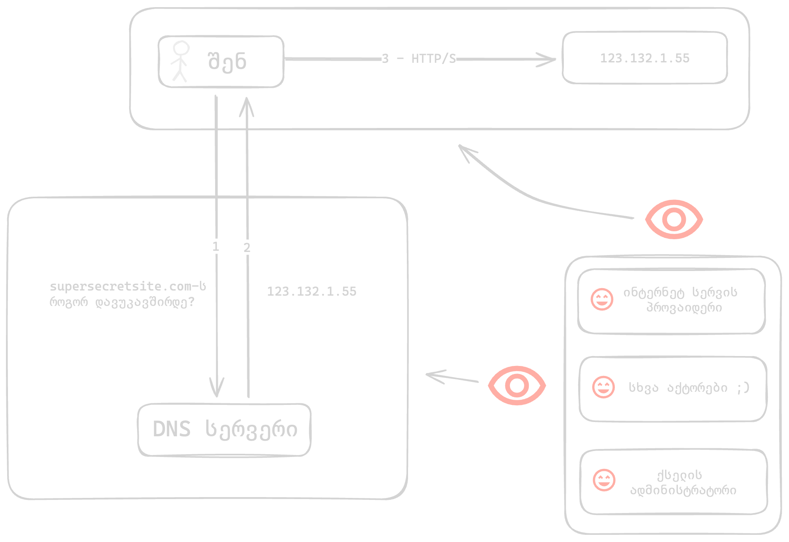
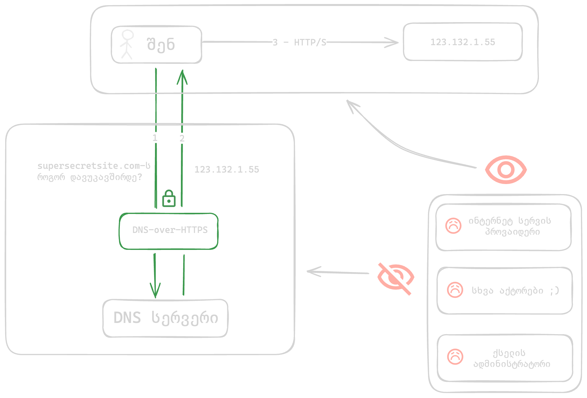

DNS — the Domain Name System, which translates domain names into IP addresses.

For example, when we type `google.com` in the browser, the browser connects to a public DNS server,
which returns google.com's IP address in response, allowing the browser to establish
a connection with google.com's server and continue all further communication using this IP address.

/// admonition | Problem
    type: danger
By default, DNS traffic is not encrypted, which means that the request sent to the DNS server is visible to everyone:
///

1. The network administrator (e.g., the Wi-Fi owner)
2. The internet service provider (which in many cases is also the owner of the DNS server the system connects to)
3. Other entities involved in sending this request to its destination and back (e.g., internet service provider's partners)

All the entities listed above gain the following capabilities:

1. Maintain records of when you visited a website or used an application
2. Block a resource

## Encrypted DNS

/// admonition | Solution
    type: success
Encrypted DNS allows us to make these requests invisible to everyone except the DNS server owner itself.
///

/// admonition | Attention
    type: warning
By using Encrypted DNS, only the DNS request is hidden from the listed actors.
After receiving the site's IP address from the DNS server, the connection from your device 
to that IP address will not be hidden. 

To hide this request, you will need a VPN.
///

There are several common Encrypted DNS protocols:

- **DNS over HTTPS (DoH)**
- DNS over TLS (DoT)
- DNS over QUIC (DoQ)

**DNS over HTTPS (DoH)** is the simplest solution, because it "hides" alongside other standard internet traffic,
making it difficult to block.

#### MacOS

On MacOS, enabling DoH is possible through a system profile.

However, applications can replace the parameters in the system profile with their own.
This often creates the risk of DNS traffic leakage.

This applies to all browsers based on the [Chromium engine][1]{:target="_blank"} (e.g., Chrome, Brave, Edge).

Because of this, the FOI system profile also contains browser settings, which instruct Chrome, Brave, Edge
browsers to use system DNS, while for Firefox — it configures 
Cloudflare DoH directly in the browser.

Instructions:

1. Install the FOI Security system profile
2. Go to Settings > Network > Filters & Proxies and activate one of the following:
    
//// admonition | Available profiles

/// tab | CloudFlare DoH (standard)

CloudFlare's DNS server. This server is standard and does not block ads or other domains.

1. "CloudFlare DoH": `Enabled`
2. Go to [https://one.one.one.one/help](https://one.one.one.one/help){:target="_blank"} in your browser and verify — `Using DNS over HTTPS (DoH) - Yes`

///

/// tab | AdGuard DoH (with ad blocking)

AdGuard's DNS server. This server blocks a significant portion of ads, tracking, and phishing.

1. "AdGuard DoH": `Enabled`
2. Go to [https://adguard.com/en/test.html](https://adguard.com/en/test.html){:target="_blank"} in your browser and verify — `Protocol: DNS-over-HTTPS`

///

////

#### iOS

On iOS, enabling DoH is possible through a system profile.

Instructions:

1. Install the FOI Security system profile
2. Go to Settings > General > VPN & Device Management > DNS and activate one of the following:
    
//// admonition | Available profiles

/// tab | CloudFlare DoH (standard)

CloudFlare's DNS server. This server is standard and does not block ads or other domains.

1. "CloudFlare DoH": `Enabled`
2. Go to [https://one.one.one.one/help](https://one.one.one.one/help){:target="_blank"} in your browser and verify — `Using DNS over HTTPS (DoH) - Yes`

///

/// tab | AdGuard DoH (with ad blocking)

AdGuard's DNS server. This server blocks a significant portion of ads, tracking, and phishing.

1. "AdGuard DoH": `Enabled`
2. Go to [https://adguard.com/en/test.html](https://adguard.com/en/test.html){:target="_blank"} in your browser and verify — `Protocol: DNS-over-HTTPS`

///

////

#### Windows

On Windows, enabling DoH is possible by changing network settings.

Instructions:

1. Settings > Network & Internet > Wi-Fi
2. Hardware Properties > DNS server assignment > Edit > Manual
3. Select Manual from the dropdown list
4. Enable IPv4

//// admonition | Available profiles

/// tab | CloudFlare DoH (standard)

CloudFlare's DNS server. This server is standard and does not block ads or other domains.

1. In Preferred DNS, enter 1.1.1.1
2. In Alternate DNS, enter 1.0.0.1
3. In DNS over HTTPS, select "On (automatic template)"
4. DNS over HTTPS will automatically fill in: `https://cloudflare-dns.com/dns-query`
5. Save
6. Go to [https://one.one.one.one/help](https://one.one.one.one/help){:target="_blank"} in your browser and verify — `Using DNS over HTTPS (DoH) - Yes`

///

/// tab | AdGuard DoH (with ad blocking)

AdGuard's DNS server. This server blocks a significant portion of ads, tracking, and phishing.

1. In Preferred DNS, enter 94.140.14.14
2. In Alternate DNS, enter 94.140.15.15
3. In DNS over HTTPS, select "On (manual template)"
4. In DNS over HTTPS, enter: `https://dns.adguard-dns.com/dns-query`
5. Save
6. Go to [https://adguard.com/en/test.html](https://adguard.com/en/test.html){:target="_blank"} in your browser and verify — `Protocol: DNS-over-HTTPS`

///

////

If you connect to the internet via cable, repeat the same steps but on the first step select
Ethernet instead of Wi-Fi.

Windows settings example

#### Android

On Android, DoH only works with two DNS services that are hardcoded [3]{:target="_blank"}.

Instead of the standard 1.1.1.1, when using a different server, the system will use
DoT (DNS-over-TLS) instead of DoH, which may often be blocked by the network administrator.

Instructions:

1. Settings > Network & Internet > Private DNS > Private DNS Provider hostname: `cloudflare-dns.com`
2. Go to https://one.one.one.one/help in your browser and verify — "Using DNS over HTTPS (DoH) - Yes"

Additional reading:

[DNS over HTTPS and DNS over TLS][2]{:target="_blank"} - Mullvad

[1]: https://issues.chromium.org/issues/40875115
[2]: https://mullvad.net/en/help/dns-over-https-and-dns-over-tls
[3]: https://cs.android.com/android/platform/superproject/main/+/d1462525f5e223dea2783b7f653ffa0a41ad8245:packages/modules/DnsResolver/PrivateDnsConfiguration.h;l=261
