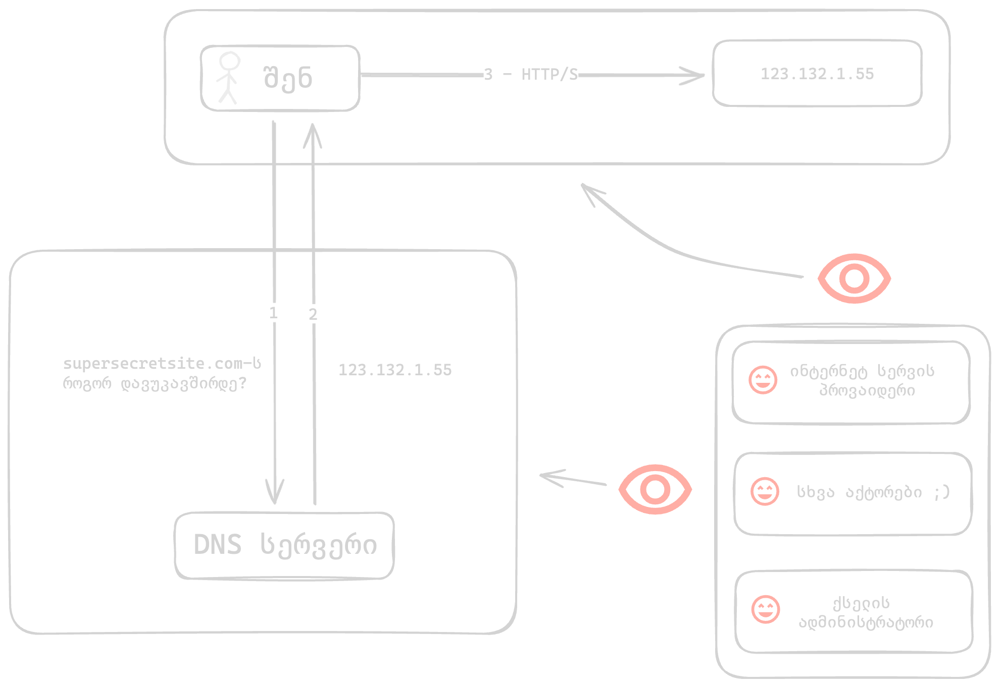
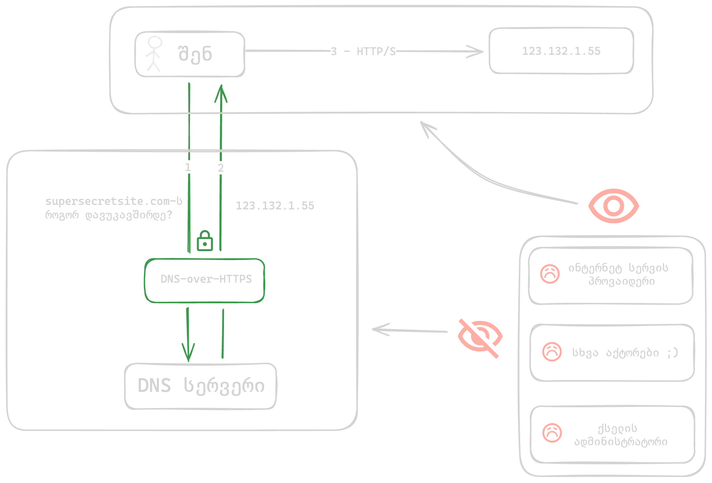

DNS - დომენების სახელების სისტემაა, რომელიც დომენის სახელს IP მისამართად თარგმნის.

მაგ. როდესაც ბრაუზერში ვწერთ `google.com`, ბრაუზერი უკავშირდება საჯარო DNS სერვერს,
რომელიც პასუხად google.com-ის IP მისამართს გვიბრუნებს, რაც საშუალებას აძლევს ბრაუზერს, რომ დაამყაროს
კავშირი google.com-ის სერვერთან და შემდგომი კომუნიკაცია სრულად ამ IP მისამართის გამოყენებით გააგრძელოს.

/// admonition | პრობლემა
    type: danger
სტანდარტულად, DNS ტრაფიკი დაშიფრული არაა, რაც ნიშნავს, რომ DNS სერვერამდე გაგზავნილი მოთხოვნა ხილულია ყველასთვის:
///

1. ქსელის ადმინისტრატორი (მაგ. WIFI-ს მფლობელი)
2. ინტერნეტ სერვისის პროვაიდერი (რომელიც ხშირ შემთხვევაში, თავადაა იმ DNS სერვერის მფლობელი, რომელსაც სისტემა უკავშირდება)
3. ამ მოთხოვნის ადრესატამდე გაგზავნასა და უკან დაბრუნებაში მონაწილე სხვა სუბიექტები (მაგ. ინტერნეტ სერვის პროვაიდერის პარტნიორები)

ზემოთ ჩამოთვლილ ყველა სუბიექტს ეს შემდეგ შესაძლებლობებს აძლევს:

1. აწარმოოს ჩანაწერები, თუ როდის შევედით რომელიმე საიტზე ან გამოვიყენეთ რომელიმე აპლიკაცია
2. დაბლოკოს რესურსი

## დაშიფრული DNS

/// admonition | გადაწყვეტა
    type: success
დაშიფრული DNS გვაძლევს საშუალებას, რომ ეს მოთხოვნები უხილავი გავხადოთ ყველასთვის, თავად DNS სერვერის მფლობელის გარდა.
///

/// admonition | ყურადღება
    type: warning
დაშიფრული DNS-ის გამოყენებით, ჩამოთვლილი აქტორებისგან მხოლოდ DNS მოთხოვნა იმალება.
DNS სერვერისგან საიტის IP მისამართის მიღების შემდეგ, თქვენი მოწყობილობიდან 
ამ IP მისამართთან დაკავშირება დაფარული არ იქნება. 

ამ მოთხოვნის დასამალად, დაგჭირდებათ VPN.
///

დაშიფრული DNS-ის რამდენიმე გავრცელებული პროტოკოლი არსებობს:

- **DNS over HTTPS (DoH)**
- DNS over TLS (DoT)
- DNS over QUIC (DoQ)

**DNS over HTTPS (DoH)** ყველაზე მარტივი გადაწყვეტილებაა, რადგან ის სხვა სტანდარტულ ინტერნეტ ტრაფიკთან ერთად "იმალება",
რაც მის დაბლოკვას ართულებს.

#### MacOS

MacOS-ზე DoH-ის ჩართვა სისტემური პროფილის მეშვეობითაა შესაძლებელი.

თუმცა აპლიკაციებს სისტემურ პროფილში არსებული პარამეტრების საკუთარით ჩანაცვლება შეუძლიათ.
რაც ხშირ შემთხვევაში, აჩენს DNS ტრაფიკის გაჟონვის რისკს.

ეს ეხება ყველა ბრაუზერს, რომელიც დაფუძნებულია [Chromium-ის ძრავზე][1] (მაგ. Chrome, Brave, Edge).

ამის გამო, FOI სისტემური პროფილი ბრაუზერების პარამეტრებსაც შეიცავს, რომელიც Chrome, Brave, Edge
ბრაუზერებს მიუთითებს, რომ გამოიყენონ სისტემური DNS, ხოლო Firefox-ის შემთხვევაში - აკონფიგურებს 
Cloudflare DoH-ს პირდაპირ ბრაუზერში.

ინსტრუქციები:

1. დააინსტალირეთ FOI Security სისტემურ პროფილი
2. შედით Settings > Network > Filters & Proxies და გააქტიურეთ ერთ-ერთი:
    
//// admonition | ხელმისაწვდომი პროფილები

/// tab | CloudFlare DoH (სტანდარტული)

CloudFlare-ის DNS სერვერი. ეს სერვერი სტანდარტულია და მასში რეკლამები ან სხვა დომენები დაბლოკილი არ არის.

1. "CloudFlare DoH": `Enabled`
2. შედით ბრაუზერიდან [https://one.one.one.one/help](https://one.one.one.one/help) და შეამოწმეთ - `Using DNS over HTTPS (DoH) - Yes`

///

/// tab | AdGuard DoH (რეკლამების ბლოკირებით)

AdGuard-ის DNS სერვერი. ამ სერვერზე დაბლოკილია რეკლამების, თრექინგის და ფიშინგის მნიშვნელოვანი ნაწილი.

1. "AdGuard DoH": `Enabled`
2. შედით ბრაუზერიდან [https://adguard.com/en/test.html](https://adguard.com/en/test.html) და შეამოწმეთ - `Protocol: DNS-over-HTTPS`

///

////

#### iOS

iOS-ზე DoH-ის ჩართვა სისტემური პროფილის მეშვეობითაა შესაძლებელი.

ინსტრუქციები:

1. დააინსტალირეთ FOI Security სისტემურ პროფილი
2. შედით Settings > General > VPN & Device Management > DNS და გააქტიურეთ ერთ-ერთი:
    
//// admonition | ხელმისაწვდომი პროფილები

/// tab | CloudFlare DoH (სტანდარტული)

CloudFlare-ის DNS სერვერი. ეს სერვერი სტანდარტულია და მასში რეკლამები ან სხვა დომენები დაბლოკილი არ არის.

1. "CloudFlare DoH": `Enabled`
2. შედით ბრაუზერიდან [https://one.one.one.one/help](https://one.one.one.one/help) და შეამოწმეთ - `Using DNS over HTTPS (DoH) - Yes`

///

/// tab | AdGuard DoH (რეკლამების ბლოკირებით)

AdGuard-ის DNS სერვერი. ამ სერვერზე დაბლოკილია რეკლამების, თრექინგის და ფიშინგის მნიშვნელოვანი ნაწილი.

1. "AdGuard DoH": `Enabled`
2. შედით ბრაუზერიდან [https://adguard.com/en/test.html](https://adguard.com/en/test.html) და შეამოწმეთ - `Protocol: DNS-over-HTTPS`

///

////

#### Windows

Windows-ზე DoH-ის ჩართვა ქსელის პარამეტრების შეცვლითაა შესაძლებელი.

ინსტრუქციები:

1. Settings > Network & Internet > Wi-Fi
2. Hardware Properties > DNS server assignment > Edit > Manual
3. ჩამოსაშლელი სიიდან ავირჩიოთ Manual
4. ჩავრთოთ IPv4

//// admonition | ხელმისაწვდომი პროფილები

/// tab | CloudFlare DoH (სტანდარტული)

CloudFlare-ის DNS სერვერი. ეს სერვერი სტანდარტულია და მასში რეკლამები ან სხვა დომენები დაბლოკილი არ არის.

1. Preferred DNS-ში ჩაწერეთ 1.1.1.1
2. Alternate DNS-ში ჩაწერეთ 1.0.0.1
3. DNS over HTTPS-ში ვირჩევთ "On (automatic template)"
4. DNS over HTTPS ავტომატურად შეივსება:  `https://cloudflare-dns.com/dns-query`
5. Save
6. შედით ბრაუზერიდან [https://one.one.one.one/help](https://one.one.one.one/help) და შეამოწმეთ - `Using DNS over HTTPS (DoH) - Yes`

///

/// tab | AdGuard DoH (რეკლამების ბლოკირებით)

AdGuard-ის DNS სერვერი. ამ სერვერზე დაბლოკილია რეკლამების, თრექინგის და ფიშინგის მნიშვნელოვანი ნაწილი.

1. Preferred DNS-ში ჩაწერეთ 94.140.14.14
2. Alternate DNS-ში ჩაწერეთ 94.140.15.15
3. DNS over HTTPS-ში ვირჩევთ "On (manual template)"
4. DNS over HTTPS შეიყვანეთ:  `https://dns.adguard-dns.com/dns-query`
5. Save
6. შედით ბრაუზერიდან [https://adguard.com/en/test.html](https://adguard.com/en/test.html) და შეამოწმეთ - `Protocol: DNS-over-HTTPS`

///

////

თუ ინტერნეტს კაბელით უკავშირდებით, გაიმეორეთ იგივე, მაგრამ პირველ ნაბიჯზე Wi-Fi-ის მაგივრად აირჩიეთ
Ethernet.

Windows პარამეტრების მაგალითი

#### Android

Android-ზე DoH მხოლოდ ორ DNS სერვისთან მუშაობს, რომელიც კოდშია გაწერილი [3].

სტანდარტული 1.1.1.1 მაგივრად, სხვა სერვერის გამოყენების შემთხვევაში, DoH-ის ნაცვლად სისტემა
DoT (DNS-over-TLS)-ს გამოიყენებს, რაც ხშირად, შესაძლოა დაბლოკილი იყოს ქსელის ადმინისტრატორის მიერ.

ინსტრუქციები:

1. Settings > Network & Internet > Private DNS > Private DNS Provider hostname: `cloudflare-dns.com`
2. შევდივართ ბრაუზერიდან https://one.one.one.one/help და ვამოწმებთ - "Using DNS over HTTPS (DoH) - Yes"

დამატებით წასაკითხი:

[DNS over HTTPS and DNS over TLS][2] - Mullvad

[1]: https://issues.chromium.org/issues/40875115
[2]: https://mullvad.net/en/help/dns-over-https-and-dns-over-tls
[3]: https://cs.android.com/android/platform/superproject/main/+/d1462525f5e223dea2783b7f653ffa0a41ad8245:packages/modules/DnsResolver/PrivateDnsConfiguration.h;l=261

