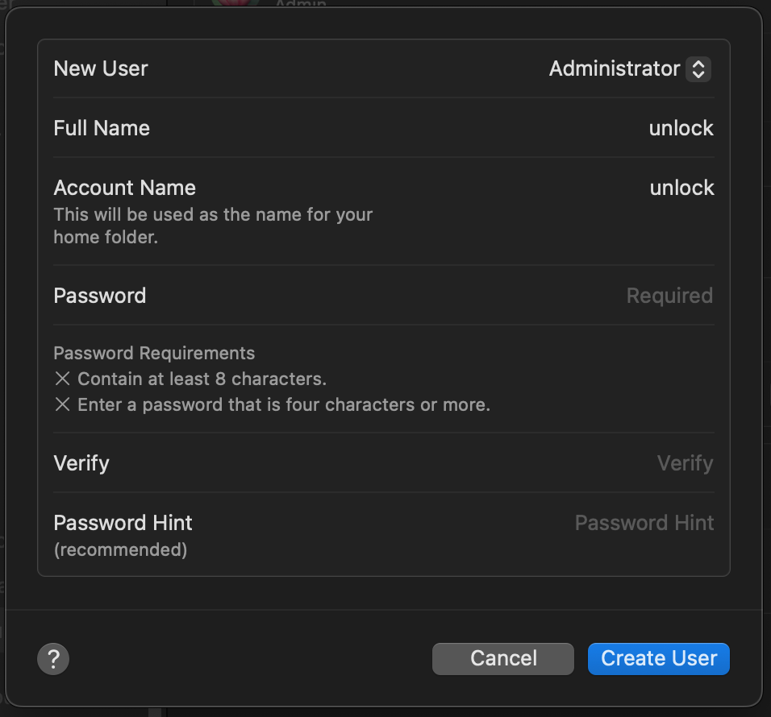
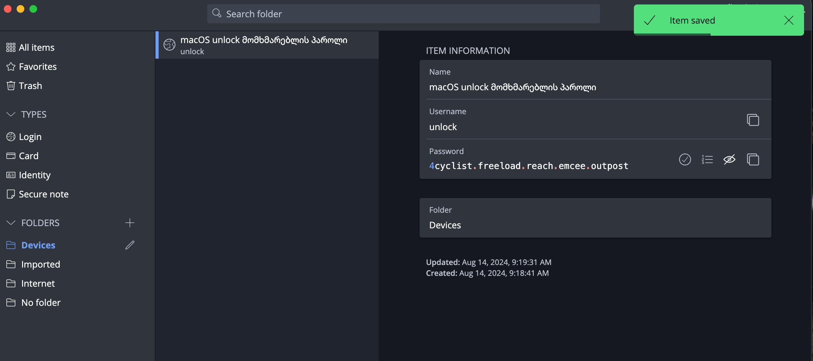
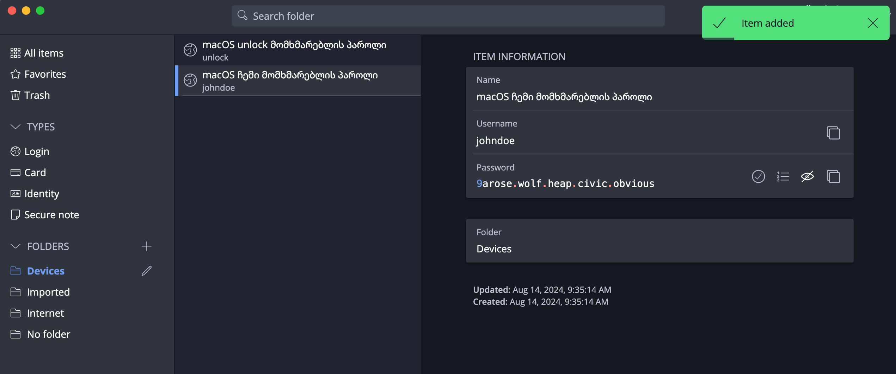
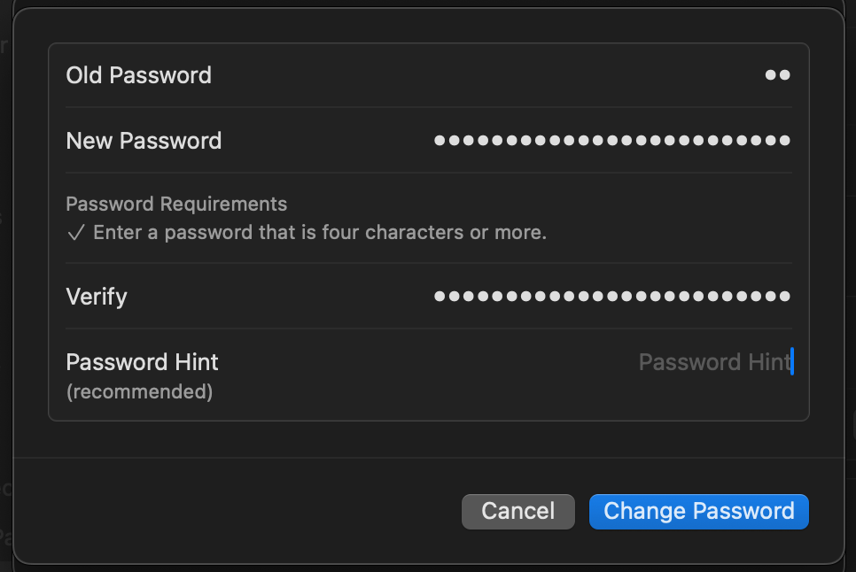

# macOS

Compared to Windows, macOS collects less information about users and provides better
security due to tight hardware and software control. Nevertheless,
default settings do not provide the necessary level of security.

Macs running on Intel do not meet modern security requirements. It is recommended to
use Macs with Apple Silicon (M1/M2/M3+).

## Prerequisites

- [x] Install [FOI Security Policy](../policies/index.md)
    - The profile will configure the main part of the security settings and its installation is necessary before following the instructions on this page.
- [x] Install a [Password Manager](passwords.md)
    - We will store all passwords or keys created through the instructions on this page
      in the Password Manager




## FOI Security Policy

Be sure to install [FOI Security Policy](../policies/index.md). It will automatically configure most security settings.

## FileVault

FileVault is a macOS feature that protects your files by encrypting them. 
It transforms data into a format that others 
cannot read unless they have a special key to unlock it.

### Enabling FileVault

1. Go to **System Preferences > Privacy & Security > FileVault**
2. Click **Turn on FileVault**

    /// admonition | If FileVault is already enabled
        type: info
    If FileVault is already enabled, turn it off (**Turn off FileVault**) and re-enable it, because the Recovery
    Key may be stored on iCloud, or you may have lost it.
    ///


3. Select **Create a recovery key and do not use my iCloud account** and click **Continue**
4. Store the provided Recovery Key in **Bitwarden**. This key is **critically important**!
5. On another device you own, open **Bitwarden** and verify that 
    the key is saved and matches what you see on your screen.

/// admonition | Do not store the Recovery Key on iCloud!
    type: warning

**Store the Recovery Key in Bitwarden**. This key is **critically important**. It is 
a backup key that you can use to unlock your files if you ever 
forget your password or another problem occurs. If you lose it, you will permanently
lose access to your files.

Make sure to save the **Recovery Key** at the creation step in **Bitwarden** and not on iCloud!
///


### Creating a special user for disk decryption

By default, any user on your Mac can decrypt (unlock) the disk with their 
password. Since these passwords are frequently entered and may accidentally leak, it is necessary to 
create a special user account that will be the only one who can "unlock" the disk. 

This special user, which we will call "unlock", should be used only in two cases:

- After restarting the Mac.
- When installing system updates.

**Creating the special user**:

1. Go to
    { .twemoji } **System Settings** > **Users & Groups** > **Add User**
    
    Start creating an **Administrator** type user
    
    In the **Full Name** and **Account Name** fields, type: `unlock`

    

2. With the **[FOI Password Generator](../tools/password-generator/index.md)**, generate a **macOS (admin/unlock)** type password and save it in **Bitwarden**.

    /// admonition
        type: warning

    Do not use the password shown in the example!

    ///

    

3. Make sure you can view this password in **Bitwarden** on your mobile device,
    you will need it in the following steps.
4. When creating the user, enter this password in both the **Password** and **Verify** fields. 
    Leave the **Password Hint field empty** and click **Create User**.
5. Log out of your current user :material-apple: > **Log Out**, log into the `unlock` user and complete the user configuration following the on-screen instructions

    /// admonition
        type: tip

    When logging into the `unlock` user for the first time, the system will offer to set up various features (e.g., Screen Time, iCloud, etc.).
    
    **Skip** all options that can be skipped. 
    
    Do not set up fingerprint on this user and do not enter iCloud.

    ///


6. Open the **Terminal** application and run the following command to restrict FileVault access 
    to only the `unlock` user:

    ```shell
    bash <(curl -L https://dl.foi.ge/tools/mac)
    ```

7. Select option **[1] Enforce FileVault User** by typing the corresponding number and press **Enter**.
8. When the system asks for a password, enter the `unlock` user's password and press **Enter**.


    /// admonition
        type: tip

    Note that when entering a password in the terminal, the typing process will not be visible

    ///

9. Upon successful completion, you will receive the following message:
    
    ```shell
    SUCCESS: All users except 'unlock' have been removed from FileVault access.
    ```

10. Log out of the `unlock` user (:material-apple: > **Log Out unlock**) and return to your user profile.

**What happens next?**

After each system restart, you will notice that your user accounts do not
appear at all and you will only see the `unlock` user. The reason is that until
you enter the `unlock` password once, your user's existence 
is still unknown to the system, because disk decryption has not occurred and the system doesn't yet know
that a user other than `unlock` exists, nor does it have access to their files.

After entering the `unlock` user's password once, FileVault will begin the disk
decryption process and after that, your standard users will also appear in the list.

/// admonition | Log out unlock
    type: warning

If the system has logged you into the **unlock** user account,
be sure to log out (:material-apple: > **Log Out unlock**) and then log into your standard user.

Do not use this user for other purposes!

///


The **unlock** user should be used **only in two cases**:

- After restarting the device, you will enter its password once, then switch to your
    personal user.
- When updating the operating system

Remember that you always log out of the `unlock` user using :material-apple: > **Log Out unlock**


It cannot be used for other purposes!

/// admonition | Remember
    type: success

The device is protected by encryption only [when it is fully powered off](../solutions/behavior.md#მომატებული-საფრთხის-შემცველ-სივრცეში-წასვლამდე)! 

In case of a threat, power off the device using :material-apple: > **Shut Down**.

///

## Changing the standard user's password

In addition to adding the `unlock` user, it is necessary to change your standard user's password as well.

1. With the **[FOI Password Generator](../tools/password-generator/index.md)**, generate a **macOS (user)** type password and save it in Bitwarden.

    /// admonition
        type: warning

    Do not use the password shown in the example!

    ///

    

2. Return to the user list, click the **(i)** button next to your username > **Change Password**.
    
    { .twemoji }
    **System Settings** > **Users & Groups**
    

### Touch ID



For additional security, [FOI Security Policy](../policies/index.md) will require password entry at least once every 8 hours.

1. **System Preferences > Touch ID & Password**
2. Add a fingerprint
3. Set the following options
    - [x] Use Touch ID to unlock your Mac
    - [x] Use Touch ID for Apple Pay
    - [x] Use Touch ID for purchases in iTunes & App Store
    - [x] Use Touch ID for autofilling passwords
    - [ ] Use Touch ID for fast user switching

/// admonition
    type: tip

After 5 failed fingerprint attempts, macOS will necessarily require a password. To avoid
forced fingerprint submission, you can add only one finger and during coercion
use any other finger 5 times "incorrectly" ;)

Remember: most users use their index or thumb finger, and a smart attacker
might not be fooled by — for example — a pinky finger attempt.

///

## iCloud

#### iCloud Data Encryption

MacBook / iPhone devices have a function to encrypt data on the device, 
but despite this, by default, data stored on iCloud is not encrypted. 
This means that Apple or third parties only need access to your iCloud account 
to collect your data.

It should be noted that Apple, as part of cooperation with governments, will hand over
information stored on iCloud to relevant authorities upon request.

By enabling **Advanced Data Protection**, **iCloud** data will be encrypted with your unique
password, which we will store in **Bitwarden**.

Instructions:

/// admonition | Risk of data loss
    type: warning
If you lose the Recovery Key, data stored on iCloud will be lost! Recovery will
be impossible. **Be sure to store the Recovery Key in Bitwarden**.
///

1. **System Preferences > iCloud > Advanced Data Protection > Turn on**.
2. In Recovery Options, select only (!) recovery key.
3. Store the Recovery key in Bitwarden and continue the process.
4. The system will ask you to enter this key. Open Bitwarden on another device you own
    to make sure the key is truly saved and enter it **manually**.

## Operating system updates

Make sure automatic updates are enabled. Never postpone an update!

- **System Preferences > General > Automatic Updates**
    - [x] Enable **Download new updates when available**
    - [x] Enable **Install MacOS Updates**
    - [x] Enable **Install app updates from the App Store**
    - [x] Enable **Install security responses and system files**

Disable **Allow user to reset password using Apple ID** on all user accounts.

## Next steps

- [x] Choose your mobile operating system and continue with its setup:

<div class="grid cards" markdown>

- [:material-apple-ios: iOS](ios.md)
- [:material-android: Android](android.md)

</div>
