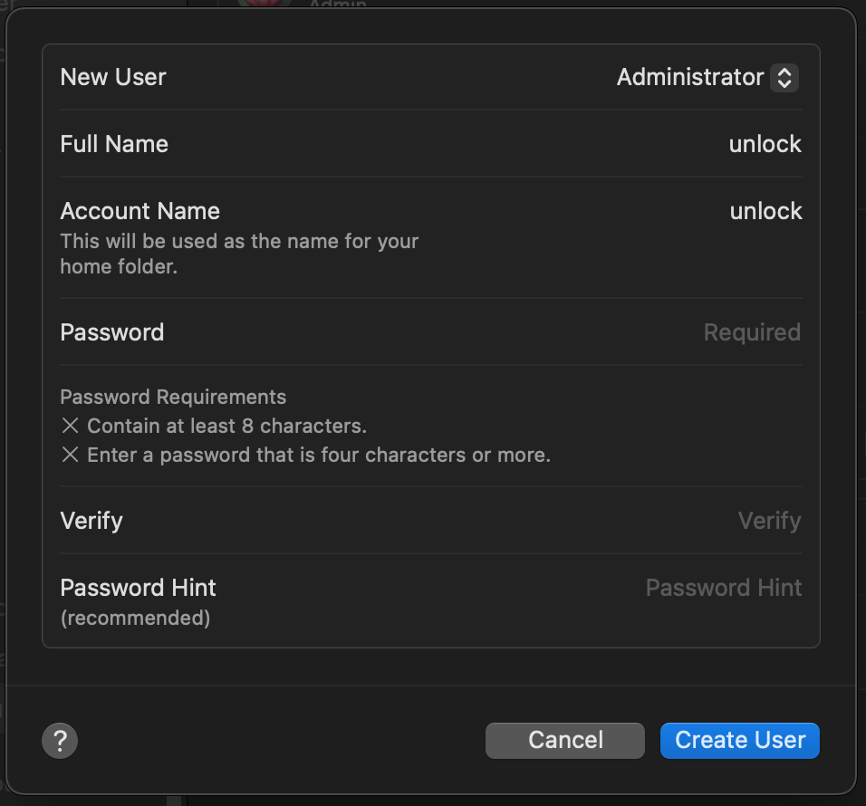

# macOS

macOS სისტემა Windows-თან შედარებით, მომხმარებელზე ნაკლებ ინფორმაციას აგროვებს და უკეთეს
უსაფრთხოებას უზრუნველყოფს, hardware და software-ს მჭიდრო კონტროლის გამო. ამის მიუხედავად,
default პარამეტრები არ უზრუნველყოფენ უსაფრთხოების აუცილებელ დონეს.

Intel-ზე მომუშავე მაკები ვერ აკმაყოფილებენ თანამედროვე უსაფრთხოების მოთხოვნებს. რეკომენდირებულია
Apple Silicon (M1/M2/M3+)-ის მქონე მაკების გამოყენება.

## აუცილებელი მოთხოვნები

- [x] [FOI Security Policy](../policies/index.md)
    - პროფილი გამართავს უსაფრთხოების პარამეტრების ძირითად ნაწილს და მისი ინსტალაცია აუცილებელია ამ გვერდზე არსებული ინსტრუქციების შესრულებამდე.
- [x] [პაროლების მენეჯერი](passwords.md)
    - პაროლების მენეჯერში შევინახავთ ყველა პაროლს ან გასაღებს, რომელსაც ამ გვერდზე
      მოცემული ინსტრუქციებით შევქმნით




## სისტემის კონფიგურაცია

### FOI Security Policy

აუცილებლად დააყენეთ [FOI Security Policy](../policies/index.md). ის უსაფრთხოების პარამეტრების უმეტესობას ავტომატურად
გამართავს.

### FileVault

FileVault დაშიფრავს თქვენს მოწყობილობაზე არსებულ ფაილებს.

- **System Preferences > Security & Privacy > FileVault**
    - [x] ჩართეთ FileVault
        - :exclamation: შეინახეთ Recovery Key Bitwarden-ში
        - :exclamation: არ შეინახოთ iCloud-ზე

/// admonition
    type: info
იმ შემთხვევაში, თუ FileVault უკვე ჩართულია, გათიშეთ და ხელახლა ჩართეთ, რადგან აღდგენის
გასაღები შესაძლოა iCloud-ზე იყოს შენახული, ან დაკარგული გქონდეთ.
///

#### შიფრაციის გასაღებზე წვდომის შეზღუდვა

macOS სისტემებზე, სტანდარტულად, ყველა მომხმარებელს აქვს დისკის დეშიფრაციის უფლება და შიფრაციისთვის
მომხმარებლის პაროლი გამოიყენება. იქიდან გამომდინარე, რომ ჩვენი მომხმარებლის პაროლი ხშირად შეგვყავს
და მისი გაჟონვის რისკი მაღალია, აუცილებელია ცალკე მომხმარებლის შექმნა და მხოლოდ მას ექნება დისკის 
დეშიფრაციის უფლება, ცალკე, უნიკალური პაროლით.

ამ მომხმარებელს გამოიყენებთ მხოლოდ ორ შემთხვევაში, სისტემის გადატვირთვის შემდეგ და სისტემის
განახლების დაყენების დროს. სხვა მიზნებისთვის ამ მომხმარებელს არ გამოიყენებთ!

1. დაიწყეთ 1 ახალი, Administrator ტიპის მომხმარებლის შექმნა, სახელით `unlock`,
    { .twemoji } **System Settings** > **Users & Groups** > **Add User**.
    

2. Bitwarden-ით დააგენერირეთ 5 სიტყვიანი პაროლი, ჩაამატეთ 1 ციფრი ნებისმიერ ადგილზე და შეინახეთ

    (**არ გამოიყენოთ მაგალითში მოცემული პაროლი!**)
    

3. გახსენით Bitwarden მობილურში და დარწმუნდით, რომ შექმნილი პაროლი მანდაც ჩანს.
4. ხელით ჩაწერეთ ეს პაროლი მომხმარებლის შექმნის ეკრანზე, **Password** და **Verify** ველებში.
5. **Password Hint**-ში არაფერი ჩაწეროთ!
5. გახსენით Terminal აპლიკაცია და ჩაწერეთ შემდეგი ბრძანება, ყველა მომხმარებელს ჩამოსათვლელად, რომელსაც
   FileVault-ის გახსნა შეუძლია:

```
sudo fdesetup list
```

მიიღებთ დაახლოებით ასეთ ჩამონათვალს:
```
johndoe,79e7361e-3a0d-43f9-b830-249c5777affd
unlock,d9c5a99d-fbbc-4122-891a-b471ee0a8bf8
```

შემდეგ, წაშალეთ ყველა მომხმარებელი, `unlock`-ის გარდა. ამისთვის გამოიყენეთ შემდეგი ბრძანება, ჩაანაცვლეთ
მაგალითში მოყვანილი `johndoe` თქვენი მომხმარებლის სახელით:

```
sudo fdesetup remove -user johndoe
```

გადატვირთეთ მოწყობილობა, ხელახლა შეიყვანეთ ბრძანება და დარწმუნდით, რომ ჩამონათვალში მხოლოდ
unlock მომხმარებელია:

```
sudo fdesetup list
```

შედეგად, მოწყობილობის გადატვირთვის შემდეგ, მხოლოდ `unlock` მომხმარებელს ექნება უფლება,
რომ მოწყობილობაზე არსებული ფაილების დეშიფრაცია მოახდინოს.

სისტემის ყოველი გადატვირთვის შემდეგ, ერთხელ შეიყვანეთ ამ მომხმარებლის პაროლი, ამ დროს FileVault დაიწყებს დისკის
დეშიფრაციას და შესაძლოა, შეგიყვანოთ ამ მომხმარებელში. იმ შემთხვევაში, თუ სისტემამ მომხმარებლის ანგარიშში
შეგიყვანათ, აუცილებლად გამოდით და შემდეგ შედით თქვენს სტანდარტულ მომხმარებელში. `unlock` მომხმარებელს
მხოლოდ დისკის დეშიფრაციისთვის და სისტემის განახლებების ინსტალაციისთვის გამოიყენებთ. სხვა მიზნებისთვის
მისი გამოყენება არ შეიძლება!

### სტანდარტული მომხმარებლის პაროლის შეცვლა

`unlock` მომხმარებლის დამატების გარდა, აუცილებელია თქვენი სტანდარტული მომხმარებლის პაროლის შეცვლაც.

1. დაბრუნდით მომხმარებლის ჩამონათვალში და თქვენი მომხმარებლის სახელის გასწვრივ დააჭირეთ **(i)** ღილაკს
    
    { .twemoji }
    **System Settings** > **Users & Groups**
    

2. Bitwarden-ით დააგენერირეთ 5 სიტყვიანი პაროლი, ჩაამატეთ 1 ციფრი ნებისმიერ ადგილზე და შეინახეთ

    (**არ გამოიყენოთ მაგალითში მოცემული პაროლი!**)
    

### Touch ID

იქიდან გამომდინარე, რომ თქვენი სტანდარტული მომხმარებლის პაროლი გაცილებით უფრო რთული შესაყვანი გახდა,
კომფორტის შესანარჩუნებლად, აუცილებელია TouchID-ის დაყენება.

მეტი უსაფრთხოებისთვის, **FOI Security Policy** 8 საათში ერთხელ პაროლის შეყვანას მაინც მოგთხოვთ.

1. **System Preferences > Touch ID & Password**
2. დაამატეთ თითის ანაბეჭდი
3. დააყენეთ შემდეგი ოფციები
    - [x] Use Touch ID to unlock your Mac
    - [x] Use Touch ID for Apple Pay
    - [x] Use Touch ID for purchases in iTunes & App Store
    - [x] Use Touch ID for autofilling passwords
    - [ ] Use Touch ID for fast user switching

/// admonition
    type: tip

არასწორი ანაბეჭდის 5 მცდელობის შემდეგ, macOS აუცილებლად პაროლს მოითხოვს. ანაბეჭდის
იძულებით ჩაბარებისგან თავის ასარიდებლად, შეგიძლიათ დაამატოთ მხოლოდ ერთი თითი და იძულების
დროს გამოიყენოთ ნებისმიერი სხვა 5-ჯერ "არასწორად" ;)

დაიმახსოვრეთ: მომხმარებლების უმრავლესობა საჩვეენებელ ან ცერა თითს იყენებს და ჭკვიან ბოროტმოქმედს
ვერ მოატყუებთ, მაგალითად, ნეკა თითის შეყვანის მცდელობით. რეკომენდირებულია "ნამდვილი" თითისთვის
რომელიმე სხვა თითის გამოყენება, ხოლო იძულებითი მცდელობების დროს, ცერა ან საჩვენებელი თითის.

///

### iCloud

#### Advanced Data Protection

MacBook / iPhone მოწყობილობებს აქვთ მოწყობილობაზე არსებული მონაცემების შიფრაციის ფუნქცია, 
მაგრამ ამის მიუხედავად, სტანდარტულად, iCloud-ზე შენახული მონაცემები დაშიფრული არაა. 
რაც იმას ნიშნავს, რომ Apple-ს ან მესამე პირებს თქვენი მონაცემების შესაგროვებლად მხოლოდ 
თქვენს iCloud ანგარიშზე წვდომა სჭირდებათ.

გასათვალისწინებელია, რომ Apple სახელმწიფოებთან თანამშრომლობის ფარგლებში, მოთხოვნის შემთხვევაში,
iCloud-ზე შენახულ ინფორმაციას გადასცემს შესაბამის ორგანოებს.

**Advanced Data Protection**-ის ჩართვით, **iCloud**-ზე მონაცემები დაშიფრული იქნება თქვენი უნიკალური
პაროლით, რომელსაც **Bitwarden**-ში შევინახავთ.

ინსტრუქციები:

/// admonition | მონაცემების დაკარგვის საფრთხე
    type: warning
Recovery Key-ის დაკარგვის შემთხვევაში, iCloud-ზე შენახული მონაცემები დაიკარგება! მისი აღდგენა
კი შეუძლებელი იქნება. **აუცილებლად შეინახეთ Recovery Key Bitwarden-ში**.
///

1. **System Preferences > iCloud > Advanced Data Protection > Turn on**.
2. Recovery Option-ებში აირჩიეთ მხოლოდ (!) recovery key.
3. შეინახეთ Recovery key Bitwarden-ში

### Software Updates

დარწმუნდით, რომ ჩართული გაქვთ ავტომატური განახლებები. არასდროს გადადოთ განახლება!

- **System Preferences > General > Automatic Updates**
    - [x] ჩართეთ **Download new updates when available**
    - [x] ჩართეთ **Install MacOS Updates**
    - [x] ჩართეთ **Install app updates from the App Store**
    - [x] ჩართეთ **Install security responses and system files**

გათიშეთ **Allow user to reset password using Apple ID** ყველა მომხმარებლის ანგარიშზე.

