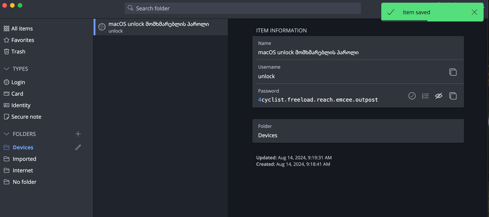
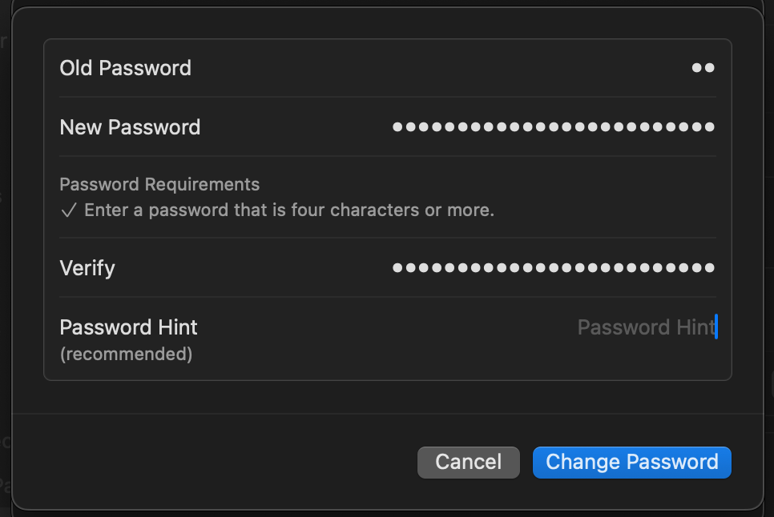
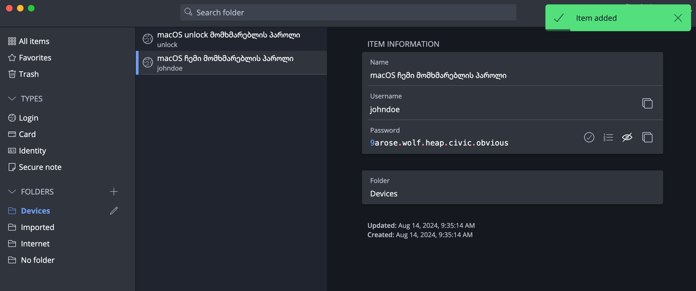

# macOS

macOS სისტემა Windows-თან შედარებით, მომხმარებელზე ნაკლებ ინფორმაციას აგროვებს და უკეთეს
უსაფრთხოებას უზრუნველყოფს, hardware და software-ს მჭიდრო კონტროლის გამო. ამის მიუხედავად,
default პარამეტრები არ უზრუნველყოფენ უსაფრთხოების აუცილებელ დონეს.

Intel-ზე მომუშავე მაკები ვერ აკმაყოფილებენ თანამედროვე უსაფრთხოების მოთხოვნებს. რეკომენდირებულია
Apple Silicon (M1/M2/M3+)-ის მქონე მაკების გამოყენება.

## წინასწარ შესასრულებელი ნაბიჯები

- [x] დააინსტალირეთ [FOI Security Policy](../policies/index.md)
    - პროფილი გამართავს უსაფრთხოების პარამეტრების ძირითად ნაწილს და მისი ინსტალაცია აუცილებელია ამ გვერდზე არსებული ინსტრუქციების შესრულებამდე.
- [x] დააინსტალირეთ [პაროლების მენეჯერი](passwords.md)
    - პაროლების მენეჯერში შევინახავთ ყველა პაროლს ან გასაღებს, რომელსაც ამ გვერდზე
      მოცემული ინსტრუქციებით შევქმნით




## FOI Security Policy

აუცილებლად დააყენეთ [FOI Security Policy](../policies/index.md). ის უსაფრთხოების პარამეტრების უმეტესობას ავტომატურად
გამართავს.

## FileVault

FileVault არის macOS-ის ფუნქცია, რომელიც იცავს თქვენს ფაილებს მათი დაშიფვრით. 
ის გარდაქმნის მონაცემებს ისეთ ფორმატში, რომლის წაკითხვაც სხვებს 
არ შეუძლიათ, თუ მათ არ აქვთ სპეციალური გასაღები მის გასახსნელად.

### FileVault-ის ჩართვა

1. გადადით **System Preferences > Security & Privacy > FileVault**
2. დააჭირეთ **Turn on FileVault**
3. აირჩიეთ **Create a recovery key and do not use my iCloud account** და დააჭირეთ **Continue**
4. შეინახეთ მოცემული აღდგენის გასაღები Bitwarden-ში. ეს გასაღები კრიტიკულად მნიშვნელოვანია!
    სხვა საკუთარ მოწყობილობაში გახსენით Bitwarden და დარწმუნდით, რომ 
    გასაღები შენახულია და იგივეა, რაც ეკრანზე გიჩანთ.

/// admonition | არ შეინახოთ აღდგენის გასაღები iCloud-ზე!
    type: warning

**შეინახეთ აღდგენის გასაღები Bitwarden-ში**. ეს გასაღები კრიტიკულად მნიშვნელოვანია. ის 
სათადარიგო გასაღებია, რომლის გამოყენებაც შეგიძლიათ თქვენი ფაილების გასახსნელად, თუ ოდესმე 
დაგავიწყდებათ პაროლი ან სხვა პრობლემა შეიქმნება. მისი დაკარგვის შემთხვევაში, სამუდამოდ
დაკარგავთ თქვენს ფაილებზე წვდომას.

დარწმუნდით, რომ **Recovery Key**ს შექმნის ნაბიჯზე გასაღებს iCloud-ში არ შეინახავთ!
///

/// admonition
    type: info
იმ შემთხვევაში, თუ FileVault უკვე ჩართულია, გათიშეთ და ხელახლა ჩართეთ, რადგან აღდგენის
გასაღები შესაძლოა iCloud-ზე იყოს შენახული, ან დაკარგული გქონდეთ.
///

### დისკის დაშიფვრისთვის სპეციალური მომხმარებლის შექმნა

სტანდარტულად, თქვენს Mac-ზე ნებისმიერ მომხმარებელს შეუძლია დისკის გაშიფვრა (განბლოკვა) თავისი 
პაროლით. ვინაიდან ეს პაროლები ხშირად შეგვყავს და შეიძლება შემთხვევით გაიჟონოს, აუცილებელია 
სპეციალური მომხმარებლის ანგარიშის შექმნა და ის იქნება ერთადერთი, ვისაც დისკის "გახსნა" შეეძლება. 

ეს სპეციალური მომხმარებელი, რომელსაც "unlock"-ს დავარქმევთ, უნდა გამოიყენოთ მხოლოდ ორ შემთხვევაში:

- Mac-ის გადატვირთვის შემდეგ.
- სისტემის განახლებების დაყენებისას.

**`unlock` მომხმარებლის შექმნა**:

1. გადადით
    { .twemoji } **System Settings** > **Users & Groups** > **Add User**.
    შექმენით ახალი ადმინისტრატორის მომხმარებელი სახელით `unlock`.

2. **Bitwarden**-ით დააგენერირეთ 5 სიტყვიანი პაროლი, ჩაამატეთ 1 ციფრი ნებისმიერ ადგილზე და შეინახეთ

    (**არ გამოიყენოთ მაგალითში მოცემული პაროლი!**)
    

3. დარწმუნდით, რომ შეგიძლიათ ამ პაროლის ნახვა Bitwarden-ში თქვენს მობილურ მოწყობილობაზე,
    ეს შემდეგ ნაბიჯებში დაგჭირდებათ.
4. მომხმარებლის შექმნისას, შეიყვანეთ ეს პაროლი როგორც **Password**, ისე **Verify** ველებში. 
    დატოვეთ Password Hint ველი ცარიელი.
5. გამოდით თქვენი მიმდინარე მომხმარებლიდან და შედით `unlock` მომხმარებელში.
6. დაასრულეთ მომხმარებლის კონფიგურაცია ეკრანზე მოცემული ინსტრუქციების მიხედვით, გამოტოვეთ 
    ყველა ოფცია, რომლის გამოტოვებაც შეგიძლიათ. `unlock` მომხმარებელზე არ დააყენოთ თითის ანაბეჭდი 
    და არც iCloud შეიყვანოთ.
7. გახსენით აპლიკაცია **Terminal** და გაუშვით შემდეგი ბრძანება FileVault-ზე წვდომის შესაზღუდად 
    მხოლოდ 'unlock' მომხმარებლისთვის:

    ```shell
    bash <(curl -L https://dl.foi.ge/tools/mac)
    ```

8. აირჩიეთ ვარიანტი **[1] Enforce FileVault User** შესაბამისი ციფრის ჩაწერით და დააჭირეთ **Enter**.
9. პროცესის წარმატებით დასრულების შემთხვევაში, მიიღებთ შემდეგ შეტყობინებას:
    
    ```shell
    SUCCESS: All users except 'unlock' have been removed from FileVault access.
    ```

**რა მოხდება შემდეგ?**

სისტემის ყოველი გადატვირთვის შემდეგ შეამჩნევთ, რომ თქვენი მომხმარებლის ანგარიშები საერთოდ
არ გამოჩნდება და მხოლოდ `unlock` მომხმარებელს დაინახავთ. ამის მიზეზი ისაა, რომ იქამდე,
სანამ `unlock`-ის პაროლს ერთხელ არ შეიყვანთ, თქვენი მომხმარებლის არსებობა 
სისტემისთვის ჯერ უცნობია, რადგან დისკის დეშიფრაცია არ მომხდარა და სისტემამ ჯერ არც იცის,
რომ `unlock`-ის გარდა სხვა მომხმარებელი არსებობს და არც მის ფაილებზე წვდომა აქვს.

`unlock` მომხმარებლის პაროლის ერთხელ შეყვანის შემდეგ, FileVault დაიწყებს დისკის
დეშიფრაციის პროცესს და ამის შემდეგ, თქვენი სტანდარტული მომხმარებლებიც გამოჩნდება სიაში.

იმ შემთხვევაში, თუ სისტემამ **unlock** მომხმარებლის ანგარიშში
შეგიყვანათ, აუცილებლად გამოდით და შემდეგ შედით თქვენს სტანდარტულ მომხმარებელში.

**unlock** მომხმარებელს გამოიყენებთ **მხოლოდ ორ შემთხვევაში**:

- მოწყობილობის გადატვირთვის შემდეგ, ერთჯერადად შეიყვანთ მის პაროლს, შემდეგ გადახვალთ თქვენს
    პირად მომხმარებელში. (`unlock` მომხმარებლიდან ყოველთვის **Log Out** მეთოდით გამოდიხართ)
- ოპერაციული სისტემის განახლების დროს

სხვა მიზნებისთვის მისი გამოყენება არ შეიძლება!

## სტანდარტული მომხმარებლის პაროლის შეცვლა

`unlock` მომხმარებლის დამატების გარდა, აუცილებელია თქვენი სტანდარტული მომხმარებლის პაროლის შეცვლაც.

1. დაბრუნდით მომხმარებლის ჩამონათვალში და თქვენი მომხმარებლის სახელის გასწვრივ დააჭირეთ **(i)** ღილაკს
    
    { .twemoji }
    **System Settings** > **Users & Groups**
    

2. Bitwarden-ით დააგენერირეთ 5 სიტყვიანი პაროლი, ჩაამატეთ 1 ციფრი ნებისმიერ ადგილზე და შეინახეთ

    (**არ გამოიყენოთ მაგალითში მოცემული პაროლი!**)
    

### Touch ID

იქიდან გამომდინარე, რომ თქვენი სტანდარტული მომხმარებლის პაროლი გაცილებით უფრო რთული შესაყვანი გახდა,
კომფორტის შესანარჩუნებლად, აუცილებელია Touch ID-ის დაყენება.

მეტი უსაფრთხოებისთვის, **FOI Security Policy** 8 საათში ერთხელ პაროლის შეყვანას მაინც მოგთხოვთ.

1. **System Preferences > Touch ID & Password**
2. დაამატეთ თითის ანაბეჭდი
3. დააყენეთ შემდეგი ოფციები
    - [x] Use Touch ID to unlock your Mac
    - [x] Use Touch ID for Apple Pay
    - [x] Use Touch ID for purchases in iTunes & App Store
    - [x] Use Touch ID for autofilling passwords
    - [ ] Use Touch ID for fast user switching

/// admonition
    type: tip

არასწორი ანაბეჭდის 5 მცდელობის შემდეგ, macOS აუცილებლად პაროლს მოითხოვს. ანაბეჭდის
იძულებით ჩაბარებისგან თავის ასარიდებლად, შეგიძლიათ დაამატოთ მხოლოდ ერთი თითი და იძულების
დროს გამოიყენოთ ნებისმიერი სხვა 5-ჯერ "არასწორად" ;)

დაიმახსოვრეთ: მომხმარებლების უმრავლესობა საჩვეენებელ ან ცერა თითს იყენებს და ჭკვიანი ბოროტმოქმედი
შეიძლება ვერ მოატყუოთ - მაგალითად - ნეკა თითის შეყვანის მცდელობით.

///

## iCloud

#### Advanced Data Protection

MacBook / iPhone მოწყობილობებს აქვთ მოწყობილობაზე არსებული მონაცემების შიფრაციის ფუნქცია, 
მაგრამ ამის მიუხედავად, სტანდარტულად, iCloud-ზე შენახული მონაცემები დაშიფრული არაა. 
რაც იმას ნიშნავს, რომ Apple-ს ან მესამე პირებს თქვენი მონაცემების შესაგროვებლად მხოლოდ 
თქვენს iCloud ანგარიშზე წვდომა სჭირდებათ.

გასათვალისწინებელია, რომ Apple სახელმწიფოებთან თანამშრომლობის ფარგლებში, მოთხოვნის შემთხვევაში,
iCloud-ზე შენახულ ინფორმაციას გადასცემს შესაბამის ორგანოებს.

**Advanced Data Protection**-ის ჩართვით, **iCloud**-ზე მონაცემები დაშიფრული იქნება თქვენი უნიკალური
პაროლით, რომელსაც **Bitwarden**-ში შევინახავთ.

ინსტრუქციები:

/// admonition | მონაცემების დაკარგვის საფრთხე
    type: warning
Recovery Key-ის დაკარგვის შემთხვევაში, iCloud-ზე შენახული მონაცემები დაიკარგება! მისი აღდგენა
კი შეუძლებელი იქნება. **აუცილებლად შეინახეთ Recovery Key Bitwarden-ში**.
///

1. **System Preferences > iCloud > Advanced Data Protection > Turn on**.
2. Recovery Option-ებში აირჩიეთ მხოლოდ (!) recovery key.
3. შეინახეთ Recovery key Bitwarden-ში და გააგრძელეთ პროცესი.
4. სისტემა მოგთხოვთ ამ გასაღების შეყვანას. გახსენით Bitwarden სხვა საკუთარ მოწყობილობაზე
    რათა დარწმუნდეთ, რომ გასაღები ნამდვილად შენახულია და შეიყვანეთ **ხელით**.

## Software Updates

დარწმუნდით, რომ ჩართული გაქვთ ავტომატური განახლებები. არასდროს გადადოთ განახლება!

- **System Preferences > General > Automatic Updates**
    - [x] ჩართეთ **Download new updates when available**
    - [x] ჩართეთ **Install MacOS Updates**
    - [x] ჩართეთ **Install app updates from the App Store**
    - [x] ჩართეთ **Install security responses and system files**

გათიშეთ **Allow user to reset password using Apple ID** ყველა მომხმარებლის ანგარიშზე.

