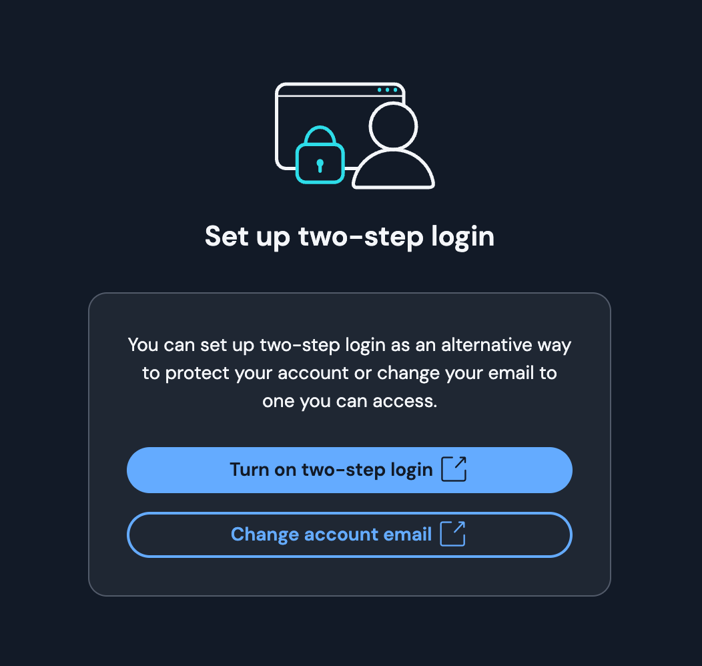

# Password Manager

/// admonition | Quick start
    type: tip

1. Download [Bitwarden](https://bitwarden.com/download/#downloads-desktop){:target="_blank"}
2. Create a Master Password with [FOI Password Generator](../tools/password-generator/index.md)
3. Write the password on paper (not electronically!)
4. Create an account in Bitwarden using the generated password. Do not save the password in browser passwords!
5. Install the [browser extension](https://bitwarden.com/download/#downloads-web-browser){:target="_blank"}
6. Import existing passwords from the browser to Bitwarden
7. Delete passwords from the browser
8. Install the [mobile app](https://bitwarden.com/download/#downloads-mobile){:target="_blank"}
9. Disable two-step authentication on Bitwarden itself:
    
    - Go to [https://vault.bitwarden.com](https://vault.bitwarden.com){:target="_blank"}
    - **Settings > My Account > Turn off new device login protection**


:exclamation: **Important warnings:**

- Do not enable two-step authentication in Bitwarden
- If two-step authentication was automatically enabled in February/March 2025, disable it!
- Do not use Bitwarden PIN code
- Keep the Master Password on paper until you memorize it
- After memorizing the password, destroy the paper
- The Password Manager password is known only to you — it cannot be recovered!
///

## What is a Password Manager and why do you need one?

In today's digital world, each of us uses dozens of different services. Each one requires a unique, complex password for security, but:

- The human brain cannot memorize many complex passwords
- Using the same password on different services is dangerous
- Writing down or storing passwords in unsecured places is risky

A Password Manager solves these problems:

:white_check_mark:&nbsp; Automatically creates unique, complex passwords for all services  
:white_check_mark:&nbsp; Securely stores all passwords in one protected place  
:white_check_mark:&nbsp; Automatically fills in passwords on websites and in apps  
:white_check_mark:&nbsp; You only need one Master Password

/// admonition |
    type: success

A Password Manager allows you to:

- Have a different, complex password on every service
- Never forget passwords
- Securely store and easily use them
///

## Recommended Password Managers

<div class="grid cards" markdown>

- { .lg .middle .twemoji } [Bitwarden](https://bitwarden.com/){:target="_blank"}

    **For those who prefer simplicity**

    ---
    - Open source and free
    - Requires internet, has automatic synchronization across all devices
    - Easy to use interface
    - Available on all platforms

- { .lg .middle .twemoji } [KeepassXC](https://keepassxc.org/){:target="_blank"}

    **For those who easily handle technical problems**

    ---
    - Open source and free
    - Works without internet, synchronization is the user's responsibility
    - Maximum security
    - Deep integration with system security
    - On mobile: [KeepassDX](https://www.keepassdx.com/){:target="_blank"} (Android) and [KeePassium](https://keepassium.com/){:target="_blank"} (iOS)

</div>

**Bitwarden** stands out for its ease of use and high security, while **KeePassXC** — for maximum security and more technical capabilities. We recommend using **Bitwarden** and will use it in the instructions.

## Getting started

### Creating the Master Password

The security of a Password Manager depends on the strength of the Master Password. It will become the **only password** you need to memorize.

Password **Entropy (password strength)**, or more simply — **strength**, is calculated using an exact mathematical formula and measured in bits. You don't need to know the mathematical formula, just remember a few important details:

1. Entropy means how random, how unpredictable the data is.
2. These two passwords, if selected by a computer, have the same strength:

```
5 random words:       armiit.gzam.qmars.uyura.bans
```

```
11 random characters:     k.Ab9p@[~BJ
```
<small>Do not use the passwords shown in the example!</small>

3. The more words selected from the word base and the more words in the word base — the greater the password's Entropy (password strength)
4. From a 9000-word base, 5 words selected **by computer** using a truly random algorithm have approximately 65 bits of strength.
5. The only difference is that you can memorize and enter the first password very easily, while the second — you cannot
6. All of this applies only to random words selected by a computer. A human cannot generate truly random, unpredictable information.
It is also impossible to determine how many words are stored in a human's vocabulary, and therefore, the strength of a human-created password is equal to 0.


/// admonition | The weakness of human-created passwords
    type: info

**A human cannot generate truly random information.**

- **The illusion of uniqueness** — 
   any word or combination of words you think of — real or imaginary — 
   is not as unique as you think.
- **Computer-generated** random password strength is evaluated by an exact mathematical formula.
- **Human-created** passwords are based on personal experience, interests, and other life details.
    **Their strength cannot be calculated.**

From a security perspective, such a password can be considered as having **0 bits of strength**, 
meaning a password that **can be cracked in less than 1 second**.
///

### Password strength table *

<div class="grid cards" markdown>

- Generated by Bitwarden
    
    (characters)

    Example:

    *`kR9$mP#vL2@nX`*

    ---
        
    | Method            | Bits (strength)      |
    |-------------------|----------------------|
    | 8 characters      | :material-close: 52  |
    | 10 characters     | :material-close: 65  |
    | 12 characters     | :material-check: 78  |
    | 14 characters     | :material-check: 91  |
    | 16 characters     | :material-check: 104 |


- [FOI Password Generator](../tools/password-generator/index.md)

    (short words)

    Example:

    *`armiit.gzam.qmars.uyura.bans`*

    ---
    
    | Method             | Bits (strength)       |
    |--------------------|-----------------------|
    | 4 words + 1 capital | :material-close:  55  |
    | 5 words            | :material-check:  65  |
    | 6 words            | :material-check:  78  |
    | 7 words            | :material-check:  91  |
    | 8 words            | :material-check:  104 |

</div>


<small>\* *Calculations use: FOI word base — ~9000 words*</small>

As the table shows, there is no difference in strength, but for passwords that you need to memorize and enter manually, words have a clear practical advantage!

<div class="grid cards" markdown>

- [FOI Password Generator](../tools/password-generator/index.md)

    ---

    For passwords you need to memorize and enter manually:

    - Bitwarden's own password
    - Mobile device password
    - Computer user password
    - Computer encryption password

    <small>You can also store these passwords in Bitwarden!</small>

</div>

<div class="grid cards" markdown>
- Generated by Bitwarden

    ---
    For all other uses:

    - Websites
    - Applications
    - Any other use

    **Bitwarden** will help you have such random, unique passwords for every use. It will securely store and automatically enter them!
    
    The only password you'll need to memorize is Bitwarden's own password.

    <small>Set Bitwarden to generate passwords with at least 14 characters each time</small>

</div>

/// admonition | Minimum strength — 65 bits
    type: warning
The Password Manager's password must have at least 65 bits of strength

The 5-word password composed by FOI Password Generator for Bitwarden has 65 bits of strength.
///

### Steps to create the Master Password
1. Generate Bitwarden's password with FOI Password Generator

    /// admonition | Tip
        type: tip

    Press the generate button until you get a password whose last word you can easily memorize.
        
    ///

    [:material-key: FOI Password Generator](../tools/password-generator/index.md){ .md-button .md-button--primary }

2. Memorizing the password:
    - Write the first four words on paper
    - Memorize the last word immediately

/// admonition | Rules for writing the Master Password on paper
    type: warning

:material-shield-alert:&nbsp; Stealing the Password Manager's password is especially dangerous — an attacker would have access to all your passwords!

:material-clock-outline:&nbsp; Writing on paper is **only a temporary solution** for the memorization process

:material-brain:&nbsp; Memorize the password as quickly as possible and destroy the paper

Follow these rules regarding the Password Manager's password:

- Do not take a photo of it
- Do not scan it
- Do not share it with anyone (not even yourself, e.g., via note to self)
- Do not save it in a file
- Do not save it in browser passwords
- Do not enter it anywhere except the Password Manager

///

/// admonition | The danger of paper storage
    type: danger

:material-shield-alert:&nbsp; Knowing even four of the five words is enough for an attacker to crack the password in seconds!

:material-shield-alert:&nbsp; Memorizing only the last word is not a protection mechanism — if the paper becomes available to a third party, the password is compromised!

:material-shield-alert:&nbsp; Paper is a **temporary solution** for the memorization process!

:material-shield-alert:&nbsp; Do not keep the paper for a long time — this significantly increases the risk of it falling into third parties' hands!

///

/// admonition | The Manager's password cannot be recovered!
    type: danger

Data stored in the Password Manager is encrypted with your password. Even **Bitwarden** itself does not have access to this data without the password.

:material-key:&nbsp; The Password Manager's password cannot be recovered — if you lose it, you will lose all your passwords!

:material-brain:&nbsp; Be sure to memorize the password fully, as quickly as possible. After that, destroy the paper!
///

### Setting up and configuring Bitwarden

/// details | Video example
        type: success
        open: false


<video controls preload="none" poster="/assets/thumb/vid/bitwarden-create-win.jpg">
    <source src="https://security-media.foi.ge/vid/bitwarden-create-win.mp4" type="video/mp4">
</video>

*Video is in Georgian; the written steps below match the demonstrated procedure.*

///

1. Download and install the application — [https://bitwarden.com/download/#downloads-desktop](https://bitwarden.com/download/#downloads-desktop){:target="_blank"}
2. **Create Account**
3. **E-mail address** — enter your email
4. **Master Password** — enter the password written on paper and the one memorized word
5. **Master Password Hint** — do not write anything!

### The danger and solution of two-step authentication

/// admonition |
    type: danger

Using two-step authentication (2FA) for a Password Manager is dangerous because it creates a circular dependency:

- If you lose all your devices and want to log into Bitwarden
- If 2FA is enabled, it will send you a code to your email when logging in from a new device
- But your email password and the password for the [2FA app](../solutions/mfa.md) needed to access it are in Bitwarden
- As a result, you can't log into Bitwarden or your email

///

Bitwarden has started requiring mandatory multi-factor authentication from new devices.





You have two options:

### Option 1: Store the recovery code securely

Two-step authentication increases security, but you need to securely store the second step's recovery code. This code will allow you to access your account without the second step, even if you lose all your devices:

1. Go to [https://vault.bitwarden.com/](https://vault.bitwarden.com/){:target="_blank"}
2. Navigate to **Settings > Security > Two-step login**
2. Click **View Recovery Code**
3. Store this code in a place where you will always have access, even if you lose all your devices and all your passwords are stored in Bitwarden

/// admonition | Recommended method for storing the recovery code
    type: tip

1. Using internet banking, make a bank transfer of a small amount between your own accounts
2. In the purpose field, write Bitwarden's recovery code with a helper search word, for example:
   `lunch R9ZR H26A 598TT HERB PHNH NAKE GGRE JKDP`
3. If you ever lose access to all your devices and your bank password is also in Bitwarden, you can visit your bank branch with an ID, gain access to your transaction history, and find the recovery code by searching for the word "lunch."

This way, you can benefit from the security of two-step authentication while having a reliable way to recover access.

Naturally, with this method, the bank and its employees will also have access to the recovery key. However, only you know the Bitwarden password, and therefore, without it, they would only know one of the two required components.

///


### Option 2: Disable two-step authentication

If you cannot securely store the Multi-factor Authentication recovery code, you can disable two-step authentication:

1. Go to [https://vault.bitwarden.com](https://vault.bitwarden.com){:target="_blank"}
2. Navigate to **Settings > Security > Two-step login** and make sure none of the options have a :material-check: mark. If any do, click **Manage** and turn it off.
2. Navigate to **Settings > My Account**
3. Find the option **Turn off new device login protection** and click it
4. Confirm the disabling


## Configuring Bitwarden

### Desktop settings

Go to settings — :simple-bitwarden: **Bitwarden > Settings**

| Section          | Setting                                                                                                        | Value                                                                                                                                         |
|------------------|----------------------------------------------------------------------------------------------------------------|----------------------------------------------------------------------------------------------------------------------------------------------------|
| **Security**     |                                                                                                                |                                                                                                                                                    |
|                  | **Vault Timeout** <br><small>Automatic vault locking</small>                                                   | `On system lock` <br><small>Bitwarden's vault will lock when the system sleeps or the user password is activated</small>                          |
|                  | **Vault timeout action** <br><small>Action on vault timeout</small>                                            | `Lock` <br><small>Lock the vault</small>                                                                                                           |
|                  | **Unlock with PIN** <br><small>Unlock vault with PIN code</small>                                              | :x: :exclamation: :exclamation: :exclamation: <br><small>**Never enable this!**</small> <br><br><small>This is an extremely weak vault protection method</small> |
|:material-fingerprint: :material-apple:| **Unlock with Touch ID** <br><small>Biometric unlock on macOS systems</small>  | :white_check_mark: <br><small>Enable, but don't use until you've memorized the password</small>                                                                           |
|:material-fingerprint: :material-microsoft-windows:|  **Unlock with Windows Hello** <br><small>Biometric unlock on Windows systems</small> | :white_check_mark: :question: <br><small>**Enable only if your Windows device has a fingerprint sensor!**</small>                                                                           |
|                  | :material-apple: :material-microsoft-windows: :material-fingerprint: **Require password or PIN on app start** <br><small>Require password on initial app launch (e.g., after computer restart)</small> | :white_check_mark: :exclamation: :exclamation: :exclamation: <br><small>After enabling biometric unlock, be sure to enable this option too!</small> |
|                  | **Approve login requests** <br><small>Unlock vault via trusted device</small>                                  | :x: <br><small>Disable</small>                                                                                                                    |
| **Preferences**  |                                                                                                                |                                                                                                                                                    |
|                  | **Minimize when copying to clipboard** <br><small>Minimize window when copying</small>                         | :x: <br><small>Disable</small>                                                                                                                    |
|                  | **Clear clipboard** <br><small>Clear clipboard</small>                                                         | `30 Seconds`                                                                                                                                        |
| **App Settings** |                                                                                                                |                                                                                                                                                    |
|                  | **Show menu bar icon** <br><small>Show icon in menu bar</small>                                                | :white_check_mark: <br><small>Enable</small>                                                                                                       |
|                  | **Minimize to menu bar** <br><small>Minimize window to menu bar</small>                                        | :white_check_mark: <br><small>Enable</small>                                                                                                       |
|                  | **Close to menu bar** <br><small>Move to menu bar on close</small>                                             | :white_check_mark: <br><small>Enable</small>                                                                                                       |
|                  | **Start to menu bar** <br><small>Launch to menu bar</small>                                                    | :white_check_mark: <br><small>Enable</small>                                                                                                       |
|                  | **Start automatically on login** <br><small>Auto-launch on system login</small>                                | :white_check_mark: <br><small>Enable</small>                                                                                                       |
|                  | **Always show in the Dock** <br><small>Always show in Dock</small>                                             | :white_check_mark: <br><small>Enable</small>                                                                                                       |
|                  | **Allow browser integration** <br><small>Allow browser integration</small>                                     | :white_check_mark: <br><small>Enable</small>                                                                                                       |
|                  | **Require verification for browser integration** <br><small>Require verification for browser integration</small> | :x: <br><small>Disable</small> <br><br><small>This system is problematic in many ways</small>                                                          |
|                  | **Use hardware acceleration** <br><small>Use hardware acceleration</small>                                     | :white_check_mark: <br><small>Enable</small>                                                                                                       |

/// admonition
    type: tip

It is better if, for the first 2-3 weeks, or until you truly memorize the Bitwarden password, 
you do not use Biometric Authentication in **Bitwarden**.

///


### Browser setup

/// details | Video example
        type: success
        open: false


<video controls preload="none" poster="/assets/thumb/vid/bitwarden-chromium.jpg">
    <source src="https://security-media.foi.ge/vid/bitwarden-chromium.mp4" type="video/mp4">
</video>

*Video is in Georgian; the written steps below match the demonstrated procedure.*

///

1. Install the browser extension — [https://bitwarden.com/download/#downloads-web-browser](https://bitwarden.com/download/#downloads-web-browser){:target="_blank"}
2. Select the installed extension and pin it (Chrome/Brave — right-click > Pin)

Browser extension settings:

1. Open browser: **:simple-brave: Brave** / :material-google-chrome: Google Chrome 
2. Click the Bitwarden extension :simple-bitwarden: **Bitwarden**
3. Enter your Bitwarden email and password
4. Go to extension settings :material-cog: **Settings** > **Account Security**
5. Configure the settings according to the table below:

/// admonition | Settings changes
    type: info

- **Unlock with biometrics** — initially disable it until you memorize the password. Then you can enable it for comfort and security.
- **Vault timeout** — initially set to `Custom > 12 Hours` so you have frequent password entry practice. After memorizing the password, change to `On system lock` for more security.
///

/// tab | Before memorizing the password
| <div style="width:20em">Setting</div>                                                                   | Value                                                                                                                                |
|----------------------------------------------------------------------------------------------------------|--------------------------------------------------------------------------------------------------------------------------------------------|
| **:material-fingerprint: Unlock with biometrics** <br><small>Biometric unlock</small>                                             | :x: :exclamation: <br><small>This will help you memorize the password, as you will need to enter it frequently.</small> |
| **Unlock with PIN** <br><small>Unlock vault with PIN code</small>                                          | :x: :exclamation: :exclamation: :exclamation: <br><small>**Never enable this!**</small> <br><small>This is an extremely weak vault protection method</small> |
| **Vault timeout** <br><small>Automatic vault lock time</small>                                             | `Custom > 12 Hours` <br><small>Vault will lock in 12 hours.</small> <br><small>This will help you memorize the password, as you will need to enter it frequently.</small> |
| **Vault timeout action** <br><small>Vault lock action</small>                                              | `Lock` |
///

/// tab | After memorizing the password
| <div style="width:20em">Setting</div>                                                                                               | Value                                                                                                                                |
|----------------------------------------------------------------------------------------------------------|--------------------------------------------------------------------------------------------------------------------------------------------|
| **:material-fingerprint: Unlock with biometrics** <br><small>Biometric unlock</small>                                             | :white_check_mark: <br><small>After enabling this option, the browser will ask for permission. After granting permission, enable it again</small> |
| **Unlock with PIN** <br><small>Unlock vault with PIN code</small>                                          | :x: :exclamation: :exclamation: :exclamation: <br><small>**Never enable this!**</small> <br><small>This is an extremely weak vault protection method</small> |
| **Vault timeout** <br><small>Automatic vault lock time</small>                                             | `On system lock` <br><small>Vault will lock when the system locks.<br>For more security, as you can always unlock it with biometrics.</small> |
| **Vault timeout action** <br><small>Vault lock action</small>                                              | `Lock` |
///


### Mobile device setup

1. Install the application — [https://bitwarden.com/download/#downloads-mobile](https://bitwarden.com/download/#downloads-mobile){:target="_blank"}
2. Set Bitwarden as the main password application

/// tab | Android

- :material-cog: **Settings** > **Passwords, passkeys & autofill** > **Preferred service** > **Bitwarden**
- **Additional services** — disable all others.

///

/// tab | iOS

- :material-cog: **Settings** > **Passwords**> **Password options**
- **Keychain** :fontawesome-solid-toggle-off:
- **Bitwarden** :fontawesome-solid-toggle-on:
- Disable all others listed, except Bitwarden.

///

/// admonition
    type: warning

**Bitwarden** has one significant drawback: on mobile devices, after enabling Biometric 
Authentication, it will never ask for the password to unlock the vault and you will always 
log in with biometrics. This almost guarantees that you will never memorize the Bitwarden 
password, and the paper will exist forever, which increases risks. 

Therefore, it is better if, for the first 2-3 weeks, or until you truly memorize the password,
you do not use Biometric Authentication in **Bitwarden**.

///

**Settings**:

/// tab | Before memorizing the password
| <div style="width:20em">Setting</div>                                                                   | Value                                                                                                                                |
|----------------------------------------------------------------------------------------------------------|--------------------------------------------------------------------------------------------------------------------------------------------|
| **:material-fingerprint: Unlock with biometrics** <br><small>Biometric unlock</small>                                             | :x: :exclamation: <br><small>This will help you memorize the password, as you will need to enter it frequently.</small> |
| **Unlock with PIN code** <br><small>PIN code unlock</small>                                              | :x: :exclamation: :exclamation: :exclamation: <br><small>**Never enable this!**</small> <br><small>This is an extremely weak vault protection method</small> |
| **Session timeout** <br><small>Session expiration</small>                                                | `1 hour` <br><small>Vault will lock in 1 hour.<br>This will help you memorize the password, as you will need to enter it frequently.</small> |
| **Vault timeout action** <br><small>Vault lock action</small>                                            | `Lock` |
///

/// tab | After memorizing the password
| <div style="width:20em">Setting</div>                                                                   | Value                                                                                                                                |
|----------------------------------------------------------------------------------------------------------|--------------------------------------------------------------------------------------------------------------------------------------------|
| **:material-fingerprint: Unlock with biometrics** <br><small>Biometric unlock</small>                                             | :white_check_mark: <br><small>After enabling this option, the app will ask for permission. After granting permission, enable it again</small> |
| **Unlock with PIN code** <br><small>PIN code unlock</small>                                              | :x: :exclamation: :exclamation: :exclamation: <br><small>**Never enable this!**</small> <br><small>This is an extremely weak vault protection method</small> |
| **Session timeout** <br><small>Session expiration</small>                                                | `5 minutes` <br><small>Vault will lock in 5 minutes.<br>For more security, as you can always unlock it with biometrics.</small> |
| **Vault timeout action** <br><small>Vault lock action</small>                                            | `Lock` |
///

/// admonition | Settings changes
    type: info

- **Unlock with biometrics** — initially disable it until you memorize the password. Then you can enable it for comfort.
- **Session timeout** — initially set to 1 hour so you have frequent password entry practice. After memorizing the password, reduce to 15 minutes for security.
///


## Importing existing passwords

Transfer passwords stored in browsers and operating systems to the Password Manager.
It would be good to create a separate folder in **Bitwarden** for such passwords. This way,
your passwords will be in one place and you'll know which passwords need to be changed and
which ones were generated by Bitwarden.

### From Google Chrome

- Use the instructions on [Bitwarden's site](https://bitwarden.com/help/import-from-chrome/){:target="_blank"}
- Make sure all passwords were successfully imported into the Password Manager
- After import is complete, delete passwords from the browser:
    - In Chrome, click :fontawesome-solid-ellipsis-vertical: > **Delete Browser Data** > **Advanced**
    - Set Time Range to **All time**
    - Check **Passwords and other sign-in data**
    - Click the **Delete Data** button

### From Apple devices

Exporting passwords saved on iPhone is not possible from the phone itself. You will need
macOS that is connected to the same iCloud account.

- Use Safari instructions on [Bitwarden's site](https://bitwarden.com/help/import-from-safari/){:target="_blank"}
- Make sure all passwords were successfully imported into the Password Manager
- After import is complete, delete passwords from all devices
    - iPhone: **Settings** > **Passwords**, scroll down with 2 fingers in the password list, select all passwords and click **Delete**.
    - macOS: **Safari** > **Settings** > **Passwords** > select all passwords and click **Delete**.

## Troubleshooting

### Biometric Authentication on macOS

Due to an [existing bug](https://github.com/bitwarden/clients/issues/5591){:target="_blank"} in Bitwarden, if you close the laptop, the Biometric Authentication option won't appear when you open it again.

Temporary solution:

1. On the Bitwarden authentication screen, press the key combination: ++cmd+l++
2. After this, the "Unlock with Touch ID" button should appear.

This issue only occurs when locking by closing the laptop and will be resolved in future Bitwarden updates.


## Next steps

- [x] Change your main passwords to Bitwarden-generated passwords and save them in the manager
    * e.g., Apple ID, Google, Facebook
- [x] Continue with Multi-factor Authentication:

<div class="grid cards" markdown>

- [:material-two-factor-authentication: Multi-factor Authentication](mfa.md)
</div>
